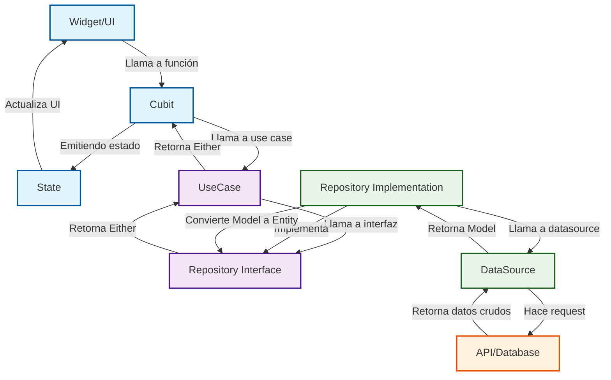

## 4. Flujo de Datos

### Diagrama de Flujo Completo

```
┌─────────────────────────────────────────────────────────────────────────────┐
│                             FLUJO DE DATOS                                  │
└─────────────────────────────────────────────────────────────────────────────┘

   USUARIO
      │
      │ "Toca botón"
      ▼
┌────────────────────────────────────────────────────────────────────────────┐
│ 1. UI (Widget)                                                             │
│    - Recibe evento del usuario                                              │
│    - Llama a método del Cubit                                              │
│                                                                            │
│    Ejemplo:                                                                 │
│    onPressed: () { context.read<UserCubit>().fetchUsers(); }               │
└────────────────────────┬───────────────────────────────────────────────────┘
                         │
                         ▼
┌────────────────────────────────────────────────────────────────────────────┐
│ 2. PRESENTATION (Cubit)                                                    │
│    - Cambia estado a Loading                                                │
│    - Llama al UseCase                                                       │
└────────────────────────┬───────────────────────────────────────────────────┘
                         │
                         ▼
┌────────────────────────────────────────────────────────────────────────────┐
│ 3. DOMAIN (UseCase)                                                        │
│    - Lógica de negocio simple                                              │
│    - Llama al Repository                                                    │
└────────────────────────┬───────────────────────────────────────────────────┘
                         │
                         ▼
┌────────────────────────────────────────────────────────────────────────────┐
│ 4. DATA (Repository Implementation)                                        │
│    - Decide fuente de datos (local/remoto)                                 │
│    - Maneja errores                                                         │
│    - Convierte Model → Entity                                              │
└────────────────────────┬───────────────────────────────────────────────────┘
                         │
                         ▼
┌────────────────────────────────────────────────────────────────────────────┐
│ 5. DATA (DataSource)                                                       │
│    - Habla directamente con la BD/API                                       │
│    - Devuelve Models                                                       │
└────────────────────────┬───────────────────────────────────────────────────┘
                         │
                         ▼
┌────────────────────────────────────────────────────────────────────────────┐
│ 6. BASE DE DATOS / API                                                     │
└────────────────────────────────────────────────────────────────────────────┘
```

### Diagrama Mermaid



### Ejemplo Paso a Paso: Operación CRUD (Leer datos)

1. **UI (Widget):** Un botón es presionado. El `onPressed` llama a `context.read<UserCubit>().fetchUsers();`.
2. **Cubit (Presentation):** El `UserCubit` recibe la llamada. Emite un estado de carga: `emit(UserLoading())`. Luego, llama al `UseCase`.
3. **UseCase (Domain):** El `GetUsersUseCase` llama al método del `Repository`.
4. **Repository Impl (Data):** Decide cómo obtener los datos. Si hay internet, pide a la fuente remota. Si no, usa la caché local.
5. **DataSource (Data):** Usa `dio` o `isar` para obtener los datos. Devuelve una lista de `UserModel`.
6. **Retorno del Flujo:**
   - El `DataSource` devuelve `List<UserModel>` al `Repository Impl`.
   - El `Repository Impl` convierte `List<UserModel>` a `List<UserEntity>`.
   - El `UseCase` recibe `Either<Failure, List<UserEntity>>` y lo devuelve al `Cubit`.
   - El `Cubit` procesa el resultado:
     - Si es un `Failure`, emite `emit(UserError(message))`.
     - Si es éxito, emite `emit(UsersLoaded(users))`.
7. **UI (Widget):** Un `BlocBuilder` escucha los cambios de estado y reconstruye la UI.

### Regla de Dependencia

```
Las flechas de dependencia SIEMPRE apuntan hacia adentro:

    UI → Presentation → Domain → Data

❌ Esto está PROHIBIDO:

    Domain → UI  (Domain NO puede saber de UI)
    Data → Domain implementación (Domain solo interfaces)
    UI → Data directo (Siempre pasar por Presentation y Domain)
```

### ¿Dónde van los Errores?

| Tipo de Error | ¿En qué capa? | ¿Qué es? | Ejemplo |
|---------------|---------------|----------|---------|
| **Exception** | **Data Layer** | Error técnico (HTTP, BD, parsing) | `ServerException`, `CacheException` |
| **Failure** | **Domain Layer** | Error de negocio (entendible por usuario) | `ServerFailure`, `NetworkFailure` |

**Flujo de errores:**
```
DataSource lanza Exception (error técnico)
        ↓
Repository atrapa Exception con try/catch
        ↓
Repository convierte Exception → Failure
        ↓
Repository retorna Either<Failure, T>
        ↓
UseCase recibe Failure
        ↓
Cubit emite estado de error
        ↓
UI muestra mensaje amigable al usuario
```

---
