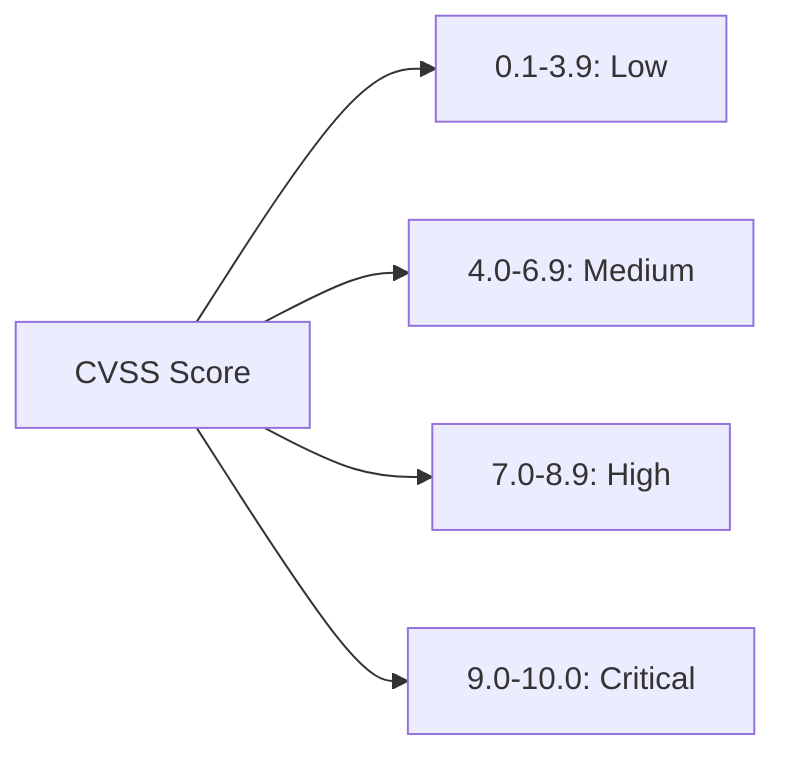

# 05 — Seguridad y Auditoría

> Detecta y responde a vulnerabilidades en dependencias de forma sistemática.

---

## 1. `dart pub deps` como Herramienta de Auditoría

```bash
# Árbol completo con versiones exactas
dart pub deps

# Formato JSON para procesar en CI
dart pub deps --json > deps.json

# Solo dependencias principales (sin dev)
dart pub deps --no-dev
```

Con `dart pub deps --json` puedes analizar el árbol con `jq`:

```bash
# Extraer todas las dependencias directas
cat deps.json | jq '.packages | to_entries[] | select(.value.kind == "direct main") | {name: .key, version: .value.version}'

# Buscar un paquete específico
cat deps.json | jq '.packages | to_entries[] | select(.key == "supabase_flutter")'
```

---

## 2. OSV.dev y GitHub Advisory Database

### 2.1 Consultar Vulnerabilidades Conocidas

```bash
# Usando OSV.dev CLI (Open Source Vulnerabilities)
pip install osv
osv query --package supabase-flutter

# O usando la API directamente
curl -X POST https://api.osv.dev/v1/query \
  -H "Content-Type: application/json" \
  -d '{"package": {"name": "supabase-flutter", "ecosystem": "Pub"}, "version": "2.17.2"}'
```

### 2.2 GitHub Advisory Database

- URL: `https://github.com/advisories?query=ecosystem%3Apub`
- Filtra por ecosistema `Pub` (Dart/Flutter) o `npm`
- Cada advisory incluye: descripción, severidad (CVSS), versión afectada, versión corregida

---

## 3. `npm audit`

```bash
# Auditoría completa
npm audit

# Solo vulnerabilidades altas y críticas
npm audit --audit-level=high

# Fix automático (patch seguro)
npm audit fix

# Fix solo para vulnerabilidades altas
npm audit fix --audit-level=high

# Formato JSON para CI
npm audit --json > audit-report.json
```

### 3.1 Integrar en CI

```yaml
# Fragmento de nextjs-ci.yml
- name: npm audit
  run: |
    npm audit --audit-level=high
  working-directory: apps/web
  continue-on-error: true  # No bloquear el build, pero reportar
```

---

## 4. Dependabot Security Updates

A diferencia de los **version updates** (PRs semanales), los **security updates** son PRs automáticos que GitHub crea cuando se detecta una CVE en una dependencia del proyecto.

### 4.1 Activación

Settings → Code security → Dependabot → Dependabot security updates → Enable

### 4.2 Flujo

```
1. GitHub detecta CVE en una dependencia del proyecto
       ↓
2. Crea PR automático con la versión parcheada
       ↓
3. CI corre automáticamente
       ↓
4. Tú revisas y mergeas
       ↓
5. GitHub marca la vulnerabilidad como resuelta
```

### 4.3 Diferencia con Version Updates

| Aspecto | Version Updates | Security Updates |
|---|---|---|
| Gatillo | Schedule (config en `dependabot.yml`) | CVE detectada (automático) |
| Prioridad | Baja | Alta |
| Auto-creación | Configurable | Siempre |
| Se puede desactivar | Sí (en `dependabot.yml`) | Sí (Settings) |

---

## 5. Severidades CVSS



### 5.1 Matriz de Respuesta

| Severidad | Acción | Plazo |
|---|---|---|
| **Critical** (9.0-10.0) | Actualizar inmediatamente. Parche manual si no hay fix | < 24h |
| **High** (7.0-8.9) | Actualizar en el próximo ciclo de trabajo | < 1 semana |
| **Medium** (4.0-6.9) | Planificar en el próximo sprint | < 1 mes |
| **Low** (0.1-3.9) | Documentar y revisar en mantenimiento trimestral | < 3 meses |

### 5.2 Sin Parche Disponible

Si hay CVE crítica pero no hay versión parcheada:

1. Evaluar si la vulnerabilidad afecta tu caso de uso
2. Si afecta: buscar paquete alternativo
3. Si no afecta: documentar la decisión y monitorear
4. Crear un issue para dar seguimiento

---

## 6. Estrategia de Seguridad en CI

### 6.1 Pipeline Ideal

```yaml
name: Security audit
on:
  schedule:
    - cron: '0 6 * * 1'  # Cada lunes
  push:
    branches: [main, dev]

jobs:
  audit:
    runs-on: ubuntu-latest
    steps:
      - uses: actions/checkout@v7

      # Flutter audit
      - uses: subosito/flutter-action@v3
        with:
          flutter-version: '3.47.0'
      - name: Dart deps audit
        run: |
          dart pub deps --json > /tmp/deps.json
          dart pub outdated --no-dev > /tmp/outdated.txt
        working-directory: apps/mobile

      # npm audit
      - name: npm audit
        run: npm audit --audit-level=high
        working-directory: apps/web
        continue-on-error: true

      # Publicar reporte
      - name: Upload audit report
        uses: actions/upload-artifact@v4
        with:
          name: security-audit
          path: |
            /tmp/deps.json
            /tmp/outdated.txt
```

### 6.2 Gate en PRs

```yaml
# Bloquear PRs si hay CVE conocida en nuevas dependencias
- name: Check for known vulnerabilities
  run: |
    dart pub deps --json | jq -r '
      .packages | to_entries[] | 
      "\(.key)@\(.value.version)"
    ' | while read pkg; do
      echo "Checking $pkg..."
      # Consultar OSV.dev API
      name=$(echo $pkg | cut -d@ -f1)
      version=$(echo $pkg | cut -d@ -f2)
      response=$(curl -s -X POST https://api.osv.dev/v1/query \
        -d "{\"package\": {\"name\": \"$name\", \"ecosystem\": \"Pub\"}, \"version\": \"$version\"}")
      if echo "$response" | grep -q '"vulns"'; then
        echo "VULNERABILITY FOUND in $pkg"
        echo "$response"
        exit 1
      fi
    done
  working-directory: apps/mobile
```

---

## 7. Ejercicio

1. Ejecuta `dart pub deps --json` en tu proyecto y extrae las dependencias directas con `jq`
2. Consulta el GitHub Advisory Database para `Pub` ecosystem y encuentra una CVE reciente
3. Integra `npm audit --audit-level=high` en el workflow `nextjs-ci.yml` del monorepo
4. Simula un escenario: se descubre CVE crítica en `dio` 5.9.0 — ¿cuál es tu plan de acción?

---

## Resumen

1. **`dart pub deps`** es tu primera herramienta de auditoría
2. **OSV.dev** y **GitHub Advisory Database** para consultar CVE conocidas
3. **`npm audit`** para dependencias web
4. **Dependabot Security Updates** para PRs automáticos de seguridad
5. **Matriz de respuesta CVSS**: Critical <24h, High <1sem, Medium <1mes
6. **Gate en CI** para bloquear nuevas dependencias con vulnerabilidades conocidas

---

## 📚 Referencias

- [OSV.dev | API](https://google.github.io/osv.dev/post-v1-query/) — Consulta de vulnerabilidades por paquete y versión
- [GitHub | Advisory Database](https://github.com/advisories) — Base de datos de CVEs con filtro por ecosistema
- [npm Docs | npm-audit](https://docs.npmjs.com/cli/v12/commands/npm-audit) — Comando `npm audit`
- [FIRST | CVSS v3.1](https://www.first.org/cvss/v3-1/) — Especificación del sistema de puntuación CVSS
- [GitHub | Dependabot security updates](https://docs.github.com/en/code-security/dependabot/dependabot-security-updates/configuring-dependabot-security-updates) — Security updates automáticos

---

> 📖 **Siguiente:** [06-deprecacion-eol-migraciones.md](./06-deprecacion-eol-migraciones.md) — Deprecación y migraciones
