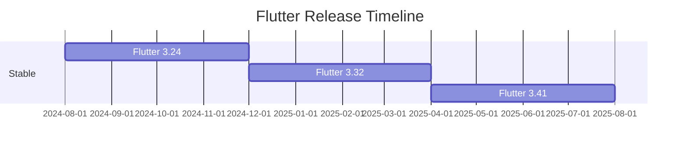

# 06 — Deprecación, EOL y Migraciones

> Identifica cuándo un paquete o herramienta está llegando a su fin y planifica la migración.

---

## 1. Señales de Deprecación

### 1.1 Indicadores Tempranos

| Señal | Riesgo | Acción |
|---|---|---|
| Sin commits en >12 meses * | Alto | Buscar alternativa |
| Issues sin respuesta del maintainer | Alto | Evaluar fork o alternativa |
| Discord/reddit recomendando migrar | Medio | Investigar |
| Package no soporta última versión de Dart | Alto | Migrar urgente |
| El paquete tiene dependencias obsoletas a su vez | Medio | Monitorear |

> \* Heurística basada en actividad del ecosistema open-source. No es una regla formal: algunos paquetes maduros tienen pocos commits pero siguen siendo funcionales y estables.

### 1.2 Ejemplos Reales en el Ecosistema Dart/Flutter

| Paquete Obsoleto | Reemplazo | Razón |
|---|---|---|
| `hive` / `hive_flutter` | `isar_community` | Hive sin mantenimiento activo, Isar es más rápido y moderno |
| `pennylane` | `fpdart` | pennylane no migró a Dart 3; fpdart tiene pattern matching, Either, Option |
| `built_value` | `freezed` / `json_serializable` | built_value es verboso; freezed es más idiomático en Dart 3 |
| `dartson` | `json_serializable` | dartson abandonado desde Dart 2 |
| `flutter_auth` / `firebase_auth` | `supabase_flutter` | Depende del backend; migración a Supabase si aplica |

### 1.3 Cómo Detectar

```bash
# Última publicación en pub.dev
dart pub outdated <paquete>

# Verificar estado del repo
# 1. Ir a github.com/<user>/<repo>
# 2. Ver pestaña "Insights" → "Contributors"
# 3. Último commit, últimas releases

# Verificar compatibilidad con Dart actual
# pub.dev → Analysis tab
```

---

## 2. Proceso de Migración

### 2.1 Flujo General

```
1. Investigar alternativa madura
   - Comunidad activa
   - Soportada activamente
   - Compatible con Dart/Flutter actual
       ↓
2. Probar en rama separada
   git checkout -b migrate/fpdart-2.0
       ↓
3. Crear capa de compatibilidad temporal
   - Wrapper/facade para aislar el cambio
       ↓
4. Migrar gradualmente
   - Feature flags si es grande
   - Un módulo a la vez
       ↓
5. Eliminar dependencia antigua
   - dart pub remove <paquete>
   - Revisar imports huérfanos
       ↓
6. Correr tests completos
       ↓
7. Actualizar guías del equipo
   - ADR de la decisión
   - Documentar breaking changes
```

### 2.2 Ejemplo: Migrar pennylane → fpdart

```dart
// ANTES: pennylane (Dart 2)
Either<Failure, User> getUser(String id) {
  return Right(user);
}

// DESPUÉS: fpdart (Dart 3)
Either<Failure, User> getUser(String id) {
  return Either.right(user);
}
```

Cambios comunes:
- `Right(value)` → `Either.right(value)`
- `Left(value)` → `Either.left(value)`
- `Option.of(value)` → `Option.fromNullable(value)`
- Pattern matching con Dart 3 (`switch` + `sealed class`)

### 2.3 Estrategia: Capa de Compatibilidad

Para migraciones grandes, crea un wrapper:

```dart
// lib/core/compat/either_compat.dart
// Temporal: migrando de pennylane a fpdart
import 'package:fpdart/fpdart.dart' as fpdart;
import 'package:pennylane/pennylane.dart' as penny;

// Re-exportar la nueva implementación
export 'package:fpdart/fpdart.dart';
```

Luego, módulo por módulo, cambias los imports del wrapper al paquete final.

---

## 3. EOL de Flutter y Dart

### 3.1 Política de Soporte de Google

Según la [compatibility policy](https://docs.flutter.dev/release/compatibility-policy) oficial, solo la última versión estable recibe soporte activo con parches completos:

```
Flutter stable:
  N (latest)     → Soporte activo (parches completos)
  N-1 o anterior → Sin soporte oficial garantizado
```

Ejemplo con Flutter 3.41.0 actual:
- 3.41.0 → soporte activo
- 3.32.0 → sin soporte oficial garantizado

> En la práctica, el ecosistema suele mantener N-1 funcional porque los paquetes rara vez exigen la versión más reciente. Sin embargo, **no hay parches de seguridad garantizados** para versiones anteriores a la última estable.

### 3.2 Calendario de Releases



> Google publica ~4 releases estables al año (~3 meses entre releases). La [compatibility policy](https://docs.flutter.dev/release/compatibility-policy) oficial solo garantiza soporte para la versión estable más reciente; el estimado de ~8 meses de soporte activo por versión es una **inferencia basada en el ciclo de releases**, no una política publicada.

### 3.3 Qué Pasa si No Actualizas

```yaml
# pubspec.yaml
environment:
  sdk: ^3.8.0  # <= Si tu SDK está por debajo del mínimo que requiere un paquete
```

- El paquete deja de recibir updates
- Nuevos paquetes pueden no ser compatibles
- Vulnerabilidades de seguridad no se parchean
- `dart pub get` empieza a fallar con versiones nuevas

### 3.4 Actualizar Dart SDK

```yaml
environment:
  sdk: ^3.11.0  # <= Actualizar cuando migres Flutter
```

`dart fix --apply` es particularmente útil después de cambiar la constraint del SDK:

```bash
# Después de actualizar el SDK constraint
dart fix --dry-run   # Ver qué cambios sugiere
dart fix --apply     # Aplicar cambios automáticos
```

---

## 4. EOL de Paquetes Específicos del Proyecto

### 4.1 Monitoreo Proactivo

```bash
# Script para detectar paquetes sin actualizar en >1 año
dart pub deps --json | jq -r '
  .packages | to_entries[] | 
  select(.key as $p | [
    "flutter", "flutter_test", "intl", "collection", "meta",
    "async", "typed_data", "vector_math", "material_color_utilities"
  ] | contains([$p]) | not) |
  "\(.key) \(.value.version)"
' | while read name version; do
  echo "Checking $name $version..."
  # Consultar pub.dev API
  last_updated=$(curl -s "https://pub.dev/api/packages/$name" | jq -r '.lastUpdated')
  echo "  Last updated: $last_updated"
done
```

### 4.2 Registro de Decisiones (ADR)

Cuando decides adoptar o reemplazar un paquete, documenta:

```markdown
# ADR-007: Migrar de pennylane a fpdart

## Contexto
pennylane no ha recibido actualizaciones en 18 meses.
No soporta Dart 3 features (pattern matching, sealed classes).

## Decisión
Migrar a fpdart 1.x, que tiene comunidad activa,
soporta Dart 3, y tiene mejor integración con bloc.

## Consecuencias
- Wrapper temporal en lib/core/compat/
- Migración módulo por módulo en 2 sprints
- -1 dependencia obsoleta, +1 dependencia activa
```

---

## 5. Estrategia de Long Term Support (LTS)

Para proyectos en producción:

| Nivel | Práctica |
|---|---|
| **Gold** | Flutter stable + 1 release atrás; paquetes actualizados a minor más reciente |
| **Silver** | Flutter stable actual; paquetes actualizados a última major |
| **Bronze** | Flutter sin actualizar por >6 meses; paquetes con 2+ majors de retraso |

El monorepo debería aspirar a **Gold**: Flutter stable, paquetes en minor más reciente, con Dependabot para patch y minor automáticos.

---

## 6. Ejercicio

1. Identifica un paquete en tu `pubspec.yaml` que no se haya actualizado en >12 meses
2. Busca alternativas maduras (pub.dev, GitHub stars, fecha de último commit)
3. Crea un plan de migración con capa de compatibilidad
4. Documenta la decisión como ADR
5. Ejecuta la migración y verifica con `flutter analyze` + `flutter test`

---

## Resumen

1. **12 meses sin commits** = bandera roja (heurística, no regla formal)
2. **Migración gradual**: capa de compatibilidad + feature flags
3. **`dart fix --apply`** después de cambiar SDK constraint
4. **ADR** para documentar decisiones de reemplazo
5. **Flutter EOL**: ~8 meses de soporte activo (inferencia del ciclo de releases, no política oficial)
6. **Nivel Gold**: Flutter stable + paquetes al día

---

## 📚 Referencias

- [Flutter | Compatibility policy](https://docs.flutter.dev/release/compatibility-policy) — Política oficial de soporte de versiones
- [Flutter | SDK archive](https://docs.flutter.dev/release/archive) — Historial de releases estables
- [Dart | dart fix](https://dart.dev/tools/dart-fix) — Migraciones automáticas de código
- [ADR | Architecture Decision Records](https://adr.github.io/) — Patrón para documentar decisiones técnicas

---

> 📖 **Siguiente:** [07-makefile-ci-objetivos.md](./07-makefile-ci-objetivos.md) — Targets de dependencias en Makefile y CI
