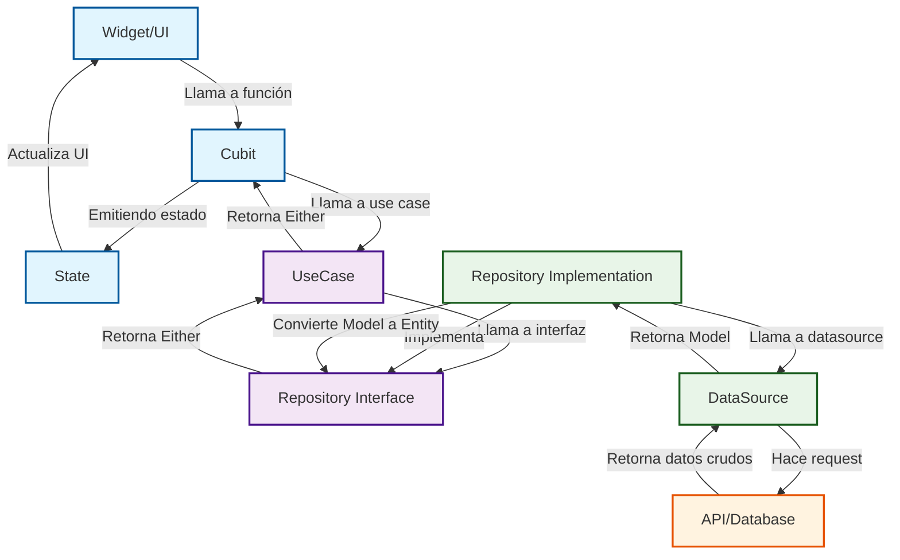

# Guía Completa de Clean Architecture con BLoC/Cubit para Flutter

Esta guía es una referencia completa para implementar Clean Architecture en proyectos Flutter utilizando `bloc` (específicamente `Cubit` para simplicidad).

## Estructura del Documento

1.  [Introducción a Clean Architecture](#1-introducción-a-clean-architecture)
2.  [Estructura de Carpetas Detallada](#2-estructura-de-carpetas-detallada)
3.  [Flujo de Datos Completo](#3-flujo-de-datos-completo)
4.  [Guía Práctica de Implementación](#4-guía-práctica-de-implementación)
5.  [Decisiones de Arquitectura](#5-decisiones-de-arquitectura)
6.  [Checklist de Implementación](#6-checklist-de-implementación)
7.  [Ejemplo Práctico Completo](#7-ejemplo-práctico-completo)
8.  [Referencia Rápida (Cheat Sheet)](#8-referencia-rápida-cheat-sheet)

---

## 1. Introducción a Clean Architecture

### ¿Qué es y por qué usarla?

Clean Architecture, propuesta por Robert C. Martin (Uncle Bob), es un diseño de software que separa el código en capas independientes con una regla de dependencia estricta: **las capas externas dependen de las internas, pero las internas no saben nada de las externas.**

**¿Por qué usarla en Flutter?**
- **Independencia del Framework:** El núcleo de tu lógica de negocio no depende de Flutter. Podrías, teóricamente, reutilizarla en un backend de Dart.
- **Testabilidad:** Cada capa se puede probar de forma aislada.
- **Escalabilidad y Mantenimiento:** Es más fácil añadir nuevas features o cambiar detalles de implementación (como una base de datos) sin afectar el resto de la app.
- **Organización:** El código está claramente organizado por funcionalidad y capa.

### Principios Fundamentales

- **Capas:** La arquitectura se divide en capas (Presentación, Dominio, Datos).
- **Regla de Dependencia:** El código fuente solo puede depender "hacia adentro".
- **Abstracciones:** Las capas se comunican a través de interfaces (clases abstractas en Dart), no de implementaciones concretas.

### Beneficios para Flutter

- **Separación de UI y Lógica:** La capa de presentación (widgets) está completamente desacoplada de la lógica de negocio.
- **Flexibilidad:** Cambiar un paquete de `http` a `dio` solo requiere modificar una clase en la capa de datos, sin tocar la UI o la lógica de negocio.
- **Claridad:** Es fácil para nuevos desarrolladores entender dónde encontrar y cómo añadir código.

---

## 2. Estructura de Carpetas Detallada

Una estructura de carpetas organizada por *features* y luego por capas es la más recomendada.

### Diagrama completo de carpetas

```
lib/
├── core/
│   ├── common/             # Clases base (UseCase) y helpers
│   ├── di/                 # Inyección de dependencias (GetIt)
│   ├── error/              # Clases de error y fallos (Failures)
│   ├── network/            # Configuración de red (Dio, etc.)
│   ├── routing/            # Configuración de navegación (GoRouter, rutas)
│   ├── services/           # Servicios externos (Firebase, etc.)
│   ├── utils/              # Clases de utilidad
│   └── widgets/            # Widgets reutilizables en toda la app
│
├── features/
│   └── feature_name/
│       ├── data/
│       │   ├── datasources/  # Fuentes de datos (remoto, local)
│       │   │   └── feature_name_remote_data_source.dart
│       │   ├── models/       # Modelos de datos (con fromJson, toJson)
│       │   │   └── feature_name_model.dart
│       │   └── repositories/ # Implementación de los repositorios
│       │       └── feature_name_repository_impl.dart
│       │
│       ├── domain/
│       │   ├── entities/     # Entidades de negocio (objetos puros)
│       │   │   └── feature_name.dart
│       │   ├── repositories/ # Contratos de los repositorios (abstract)
│       │   │   └── feature_name_repository.dart
│       │   └── usecases/     # Casos de uso específicos
│       │       └── get_feature_name.dart
│       │
│       └── presentation/
│           ├── cubit/        # Cubits y estados
│           │   ├── feature_name_cubit.dart
│           │   └── feature_name_state.dart
│           └── pages/        # Páginas/Screens
│               └── feature_name_page.dart
│
└── main.dart
```

### Explicación de cada capa

- **`core`**: Código que se puede reutilizar en cualquier parte del proyecto. No debe depender de ninguna *feature*.
    - `common`: Clases base, helpers y abstracciones que se usan en toda la app, como la clase `UseCase` base.
    - `services`: Abstracciones y/o implementaciones de servicios externos como Analytics, Crash Reporting, Notificaciones Push, etc.
    - `routing`: Configuración centralizada del sistema de navegación de la aplicación. Define todas las rutas, guardias de autenticación, y manejo de navegación profunda. Permite mantener separada la lógica de navegación del UI y facilita el mantenimiento de las rutas de la aplicación.
    - `widgets`: Widgets reutilizables a través de diferentes features (ej: `CustomButton`, `LoadingIndicator`).
- **`features`**: Contiene las diferentes funcionalidades de la aplicación (ej: `login`, `profile`, `home`).
    - **`data`**: Implementación concreta de la obtención de datos. Habla con APIs, bases de datos locales, etc.
        - `datasources`: Responsable de una única fuente (API REST, Firebase, SQLite).
        - `models`: Extensiones de las `entities` que añaden lógica de serialización (`fromJson`, `toJson`).
        - `repositories`: Implementa el `repository` del dominio. Es un puente entre los `datasources` y el dominio. Decide si los datos vienen de la caché, de la red, etc.
    - **`domain`**: El núcleo de la aplicación. Contiene la lógica de negocio pura. No depende de ningún framework ni paquete externo.
        - `entities`: Objetos de negocio que representan los datos. No tienen lógica de serialización.
        - `repositories`: Contratos (clases abstractas) que definen qué se puede hacer con los datos.
        - `usecases`: Representan una única acción o caso de uso de la aplicación (ej: `LoginUser`, `GetArticle`). Orquestan el flujo de datos llamando a los repositorios.
    - **`presentation`**: La capa de UI. Contiene las páginas y el manejo de estado (Cubit/BLoC) para una feature específica.
        - `cubit`/`bloc`: Gestiona el estado de la UI de la feature y se comunica con los `usecases`.
        - `pages`/`screens`: Las pantallas que el usuario ve, específicas de esta feature.

---

## 3. Flujo de Datos Completo

El flujo de datos es unidireccional y sigue la regla de dependencia.

### Diagrama del flujo: UI → Cubit → UseCase → Repository → DataSource



### Ejemplo paso a paso de una operación CRUD (Leer datos)

### Ejemplo paso a paso de una operación CRUD (Leer datos)

1.  **UI (Widget):** Un `ElevatedButton` es presionado. El `onPressed` llama a una función en el `Cubit`: `context.read<UserCubit>().fetchUsers();`.
2.  **Cubit (Presentation):** El `UserCubit` recibe la llamada. Emite un estado de carga: `emit(UserLoading())`. Luego, llama al `UseCase` correspondiente: `final result = await getUserUseCase(NoParams());`.
3.  **UseCase (Domain):** El `GetUserUseCase` llama al método del `Repository` (la interfaz): `return await repository.getUsers();`.
4.  **Repository Impl (Data):** La implementación del repositorio (`UserRepositoryImpl`) decide cómo obtener los datos. Por ejemplo, primero intenta obtenerlos de una fuente de datos local. Si no están, los pide a la fuente remota. `final users = await remoteDataSource.getUsers();`.
5.  **DataSource (Data):** El `UserRemoteDataSource` usa un paquete como `http` o `dio` para hacer una petición a una API. Si la petición es exitosa, parsea el JSON y devuelve una lista de `UserModel`.
6.  **Retorno del Flujo:**
    - El `DataSource` devuelve `List<UserModel>` al `Repository Impl`.
    - El `Repository Impl` convierte `List<UserModel>` a `List<UserEntity>` y lo devuelve al `UseCase`.
    - El `UseCase` recibe el resultado (un `Either<Failure, List<UserEntity>>`) y lo devuelve al `Cubit`.
    - El `Cubit` procesa el resultado:
        - Si es un `Failure`, emite `emit(UserError(message))`.
        - Si es éxito, emite `emit(UserLoaded(users))`.
7.  **UI (Widget):** Un `BlocBuilder` escucha los cambios de estado. Cuando recibe `UserLoaded`, reconstruye la UI para mostrar la lista de usuarios. Si recibe `UserError`, muestra un mensaje de error.

---

## 4. Guía Práctica de Implementación

### Cómo empezar un nuevo proyecto

1.  **Crea el proyecto Flutter:** `flutter create my_app`
2.  **Añade dependencias en `pubspec.yaml`:**
    ```yaml
    dependencies:
      flutter:
        sdk: flutter
      # State Management
      flutter_bloc: ^8.1.3
      # Inyección de dependencias
      get_it: ^7.6.4
      # Comparación de objetos
      equatable: ^2.0.5
      # Functional programming (para Either)
      dartz: ^0.10.1
      # Red
      dio: ^5.3.3
      # Conectividad
      internet_connection_checker: ^1.0.0+1
    ```
3.  **Crea la estructura de carpetas** como se describe en la sección 2.

### Template para cada capa

#### Domain

**Entity (`/domain/entities/user.dart`)**

```dart
import 'package:equatable/equatable.dart';

class User extends Equatable {
  final int id;
  final String name;
  final String email;

  const User({required this.id, required this.name, required this.email});

  @override
  List<Object?> get props => [id, name, email];
}
```

**Repository Interface (`/domain/repositories/user_repository.dart`)**

```dart
import 'package:dartz/dartz.dart';
import 'package:my_app/core/error/failures.dart';
import 'package:my_app/features/user/domain/entities/user.dart';

abstract class UserRepository {
  Future<Either<Failure, List<User>>> getUsers();
}
```

**UseCase (`/domain/usecases/get_users.dart`)**

```dart
import 'package:dartz/dartz.dart';
import 'package:my_app/core/error/failures.dart';
import 'package:my_app/core/common/usecase.dart';
import 'package:my_app/features/user/domain/entities/user.dart';
import 'package:my_app/features/user/domain/repositories/user_repository.dart';

class GetUsers extends UseCase<List<User>, NoParams> {
  final UserRepository repository;

  GetUsers(this.repository);

  @override
  Future<Either<Failure, List<User>>> call(NoParams params) async {
    return await repository.getUsers();
  }
}
```

#### Data

**Model (`/data/models/user_model.dart`)**

```dart
import 'package:my_app/features/user/domain/entities/user.dart';

class UserModel extends User {
  const UserModel({required int id, required String name, required String email})
      : super(id: id, name: name, email: email);

  factory UserModel.fromJson(Map<String, dynamic> json) {
    return UserModel(
      id: json['id'],
      name: json['name'],
      email: json['email'],
    );
  }

  Map<String, dynamic> toJson() {
    return {
      'id': id,
      'name': name,
      'email': email,
    };
  }
}
```

**Remote Data Source (`/data/datasources/user_remote_data_source.dart`)**

```dart
import 'package:dio/dio.dart';
import 'package:my_app/core/error/exceptions.dart';
import 'package:my_app/features/user/data/models/user_model.dart';

abstract class UserRemoteDataSource {
  Future<List<UserModel>> getUsers();
}

class UserRemoteDataSourceImpl implements UserRemoteDataSource {
  final Dio client;

  UserRemoteDataSourceImpl({required this.client});

  @override
  Future<List<UserModel>> getUsers() async {
    final response = await client.get('https://api.example.com/users');

    if (response.statusCode == 200) {
      return (response.data as List)
          .map((user) => UserModel.fromJson(user))
          .toList();
    } else {
      throw ServerException();
    }
  }
}
```

**Repository Implementation (`/data/repositories/user_repository_impl.dart`)**

```dart
import 'package:dartz/dartz.dart';
import 'package:my_app/core/error/exceptions.dart';
import 'package:my_app/core/error/failures.dart';
import 'package:my_app/core/network/network_info.dart';
import 'package:my_app/features/user/data/datasources/user_remote_data_source.dart';
import 'package:my_app/features/user/domain/entities/user.dart';
import 'package:my_app/features/user/domain/repositories/user_repository.dart';

class UserRepositoryImpl implements UserRepository {
  final UserRemoteDataSource remoteDataSource;
  final NetworkInfo networkInfo;

  UserRepositoryImpl({
    required this.remoteDataSource,
    required this.networkInfo,
  });

  @override
  Future<Either<Failure, List<User>>> getUsers() async {
    if (await networkInfo.isConnected) {
      try {
        final remoteUsers = await remoteDataSource.getUsers();
        return Right(remoteUsers);
      } on ServerException {
        return Left(ServerFailure());
      }
    } else {
      return Left(NetworkFailure());
    }
  }
}
```

#### Presentation

**Cubit State (`/presentation/cubit/user_state.dart`)**

```dart
part of 'user_cubit.dart';

abstract class UserState extends Equatable {
  const UserState();

  @override
  List<Object> get props => [];
}

class UserInitial extends UserState {}
class UserLoading extends UserState {}
class UserLoaded extends UserState {
  final List<User> users;

  const UserLoaded(this.users);

  @override
  List<Object> get props => [users];
}
class UserError extends UserState {
  final String message;

  const UserError(this.message);

  @override
  List<Object> get props => [message];
}
```

**Cubit (`/presentation/cubit/user_cubit.dart`)**

```dart
import 'package:bloc/bloc.dart';
import 'package:equatable/equatable.dart';
import 'package:my_app/core/common/usecase.dart';
import 'package:my_app/features/user/domain/entities/user.dart';
import 'package:my_app/features/user/domain/usecases/get_users.dart';

part 'user_state.dart';

class UserCubit extends Cubit<UserState> {
  final GetUsers getUsers;

  UserCubit({required this.getUsers}) : super(UserInitial());

  Future<void> fetchUsers() async {
    emit(UserLoading());
    final failureOrUsers = await getUsers(NoParams());
    failureOrUsers.fold(
      (failure) => emit(UserError(_mapFailureToMessage(failure))),
      (users) => emit(UserLoaded(users)),
    );
  }

  String _mapFailureToMessage(Failure failure) {
    // ...
  }
}
```

---

## 5. Decisiones de Arquitectura

### Cubit vs BLoC (cuándo usar cada uno)
- **Cubit:** Más simple y con menos "boilerplate". Ideal para la mayoría de los casos donde el estado es una consecuencia directa de una llamada a una función. Usa funciones para cambiar el estado.
- **BLoC:** Más verboso pero más potente. Usa eventos (`Event`) para desencadenar cambios de estado, lo que permite un `trace` completo de las interacciones. Úsalo para lógicas de estado complejas (ej: un formulario con múltiples pasos y validaciones en tiempo real).

**Recomendación:** Empieza con `Cubit`. Si la lógica se vuelve muy compleja, refactoriza a `BLoC`.

### Inyección Manual vs GetIt
- **Inyección Manual:** Pasar dependencias a través de los constructores. Es explícito y claro, pero puede volverse tedioso en apps grandes.
- **GetIt (Service Locator):** Un localizador de servicios que desacopla la creación de la instancia de su uso. Simplifica el código al no tener que pasar dependencias por múltiples capas.

**Recomendación:** Usa `GetIt` para evitar el "constructor drilling". Centraliza la configuración de dependencias en un único archivo (`core/di/injection_container.dart`).

### Validaciones y manejo de errores
- **Failures:** Clases que representan errores de negocio o de sistema (ej: `ServerFailure`, `CacheFailure`). Se usan en el `Either` del `dartz` para un manejo de errores funcional y explícito.
- **Exceptions:** Se lanzan en la capa de `Data` (ej: `ServerException` cuando un código de estado no es 200) y se capturan en el `RepositoryImpl` para convertirlas en `Failures`. La UI nunca debe ver una `Exception`.

---

## 6. Checklist de Implementación

Al crear una nueva *feature*:

1.  **Dominio:**
    - [ ] Crear la `Entity`.
    - [ ] Definir el contrato del `Repository` (interfaz abstracta).
    - [ ] Crear el `UseCase` para una acción específica.
2.  **Datos:**
    - [ ] Crear el `Model` que extiende la `Entity` y añade `fromJson`/`toJson`.
    - [ ] Crear el `DataSource` (remoto y/o local) que obtiene los datos brutos.
    - [ ] Implementar el `Repository` del dominio, conectando el `DataSource` y manejando errores.
3.  **Presentación:**
    - [ ] Definir los `States` del Cubit (`Initial`, `Loading`, `Loaded`, `Error`).
    - [ ] Crear el `Cubit`, inyectar el `UseCase` y llamar a su método.
    - [ ] Crear la `Page` o `Screen` que usará un `BlocProvider` para proveer el `Cubit`.
    - [ ] Usar `BlocBuilder` o `BlocListener` para reaccionar a los cambios de estado y construir la UI.
4.  **Inyección de Dependencias:**
    - [ ] Registrar todas las nuevas clases (Cubit, UseCase, Repository, DataSource) en `GetIt`.

---

## 7. Ejemplo Práctico Completo

### Todo el flujo de crear una feature nueva: "Tareas"

1.  **Feature `task`:** Crear carpetas `data`, `domain`, `presentation` dentro de `lib/features/task`.
2.  **Domain:**
    - `task_entity.dart`: `class Task { final int id; final String title; final bool isCompleted; }`
    - `task_repository.dart`: `abstract class TaskRepository { Future<Either<Failure, List<Task>>> getTasks(); }`
    - `get_tasks.dart`: `class GetTasks extends UseCase<List<Task>, NoParams> { ... }`
3.  **Data:**
    - `task_model.dart`: `class TaskModel extends Task { ... fromJson, toJson }`
    - `task_remote_data_source.dart`: Usa `dio` para llamar a `api/tasks`.
    - `task_repository_impl.dart`: Implementa `TaskRepository`, llama al `DataSource`, y maneja `ServerException` -> `ServerFailure`.
4.  **Presentation:**
    - `task_cubit.dart` y `task_state.dart`: `TaskInitial`, `TaskLoading`, `TaskLoaded(List<Task> tasks)`, `TaskError(String message)`.
    - El `TaskCubit` llama a `GetTasks`.
    - `task_page.dart`: `BlocProvider` para `TaskCubit`, `BlocBuilder` para mostrar un `ListView` de tareas o un `CircularProgressIndicator`.
5.  **DI (`injection_container.dart`):**
    - Registrar `TaskCubit`, `GetTasks`, `TaskRepository`, `TaskRemoteDataSource`.

---

## 8. Referencia Rápida (Cheat Sheet)

### Comandos y patrones comunes

- **Crear UseCase genérico:**
  ```dart
  import 'package:dartz/dartz.dart';
  import 'package:equatable/equatable.dart';
  import 'package:my_app/core/error/failures.dart';

  abstract class UseCase<Type, Params> {
    Future<Either<Failure, Type>> call(Params params);
  }

  class NoParams extends Equatable {
    @override
    List<Object?> get props => [];
  }
  ```

- **Patrón RepositoryImpl:**
  ```dart
  Future<Either<Failure, Type>> _getBody<Type>(Future<Type> Function() getBody) async {
    if (await networkInfo.isConnected) {
      try {
        return Right(await getBody());
      } on ServerException {
        return Left(ServerFailure());
      }
    } else {
      return Left(NetworkFailure());
    }
  }
  ```

### Preguntas frecuentes

- **¿Dónde pongo la lógica de validación de formularios?**
  - En el `Cubit`/`BLoC`. Puede emitir estados que representen si el formulario es válido o no, o si un campo específico tiene un error.

- **¿Cómo manejo la navegación?**
  - La navegación se dispara desde la capa de presentación. Un `BlocListener` puede escuchar un estado específico (ej: `LoginSuccess`) y llamar a `Navigator.push()`.

- **¿Dónde van los `Enums` o constantes globales?**
  - En `lib/core/utils/` o `lib/core/constants/`.

---

Esta guía proporciona una base sólida. La clave es la **disciplina** para mantener las fronteras entre capas. ¡Feliz codificación!
