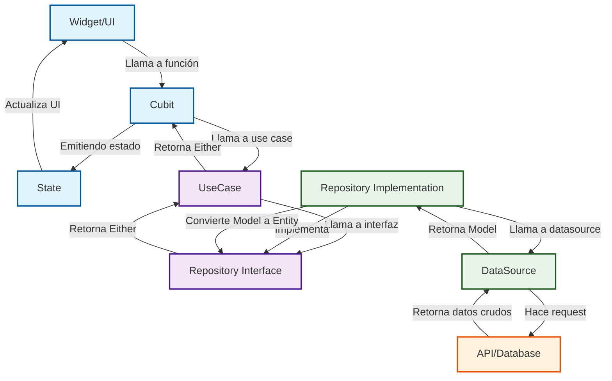

# Guía Completa de Clean Architecture para Flutter

> Documento unificado que combina Introducción, Filosofía, Estructura, Flujo de Datos, Implementación Práctica con Sistema de Usuarios CRUD, Inyección de Dependencias, Testing y Templates.

---

## Tabla de Contenidos

1. [Introducción y Filosofía](#1-introducción-y-filosofía)
2. [Las 4 Capas de Clean Architecture](#2-las-4-capas-de-clean-architecture)
3. [Estructura de Carpetas](#3-estructura-de-carpetas)
4. [Flujo de Datos](#4-flujo-de-datos)
5. [Implementación Práctica: Sistema de Usuarios CRUD](#5-implementación-práctica-sistema-de-usuarios-crud)
6. [Inyección de Dependencias con GetIt](#6-inyección-de-dependencias-con-getit)
7. [Testing por Capas](#7-testing-por-capas)
8. [Templates Universales](#8-templates-universales)
9. [Decisiones de Arquitectura](#9-decisiones-de-arquitectura)
10. [Migración desde Código Espagueti](#10-migración-desde-código-espagueti)

---

## 1. Introducción y Filosofía

### ¿Qué es Clean Architecture?

Clean Architecture, propuesta por Robert C. Martin (Uncle Bob), es un diseño de software que separa el código en capas independientes con una **regla de dependencia estricta**: las capas externas dependen de las internas, pero las internas no saben nada de las externas.

### La Analogía del Restaurante

Imagina un restaurante donde pides una hamburguesa:

| Tu Código | Restaurante | Qué Hace |
|-----------|-------------|----------|
| **Domain** | La Receta | Dice qué ingredientes necesitas |
| **Data** | La Cocina | Cocina los ingredientes |
| **Repository** | El Almacén | Decide si usa carne fresca o congelada |
| **UseCase** | El Chef | Sigue la receta paso a paso |
| **Cubit** | El Mesero | Lleva tu pedido y trae la comida |
| **UI** | Tu Mesa | Donde comes y pides |

**Regla importante**: Tú (UI) **NUNCA** entras a la cocina (Data). Todo pasa por el mesero (Cubit).

### La Analogía del Edificio de Oficinas

Clean Architecture organiza el código como un edificio de varias plantas:

```
         ┌─────────────────────────────────────┐
         │      PLANTA 4: UI (Presentation)    │
         │    ┌─────┐ ┌─────┐ ┌─────┐         │
         │    │Pág 1│ │Pág 2│ │Pág 3│         │
         │    └──┬──┘ └──┬──┘ └──┬──┘         │
         └───────┼───────┼───────┼─────────────┘
                 │       │       │
                 ▼       ▼       ▼
         ┌─────────────────────────────────────┐
         │     PLANTA 3: LÓGICA (Domain)        │
         │   ┌────────┐ ┌────────┐             │
         │   │UseCase1│ │UseCase2│             │
         │   └───┬────┘ └────┬───┘             │
         └───────┼───────────┼─────────────────┘
                 │           │
                 ▼           ▼
         ┌─────────────────────────────────────┐
         │    PLANTA 2: CONTRATOS (Repository) │
         │        ┌──────────────┐             │
         │        │   Interface  │             │
         │        └──────┬───────┘             │
         └───────────────┼─────────────────────┘
                         │
                         ▼
         ┌─────────────────────────────────────┐
         │      PLANTA 1: DATOS (Data)          │
         │  ┌──────────┐ ┌──────────┐          │
         │  │DataSource│ │   Model  │          │
         │  └──────────┘ └──────────┘          │
         └─────────────────────────────────────┘
```

**Regla de Oro**: Código de plantas superiores NUNCA conoce detalles de plantas inferiores.

### ¿Por qué usar Clean Architecture?

- **Independencia del Framework:** El núcleo de tu lógica de negocio no depende de Flutter.
- **Testabilidad:** Cada capa se puede probar de forma aislada.
- **Escalabilidad y Mantenimiento:** Fácil añadir features o cambiar implementaciones.
- **Organización:** Código claramente organizado por funcionalidad y capa.

### El Problema: Código Espagueti

Imagina un plato de espagueti donde todo está mezclado:
- UI con lógica de negocio
- Llamadas HTTP en los widgets
- Base de datos acoplada a la interfaz
- Imposible de testear
- Un cambio rompe todo

---

## 2. Las 4 Capas de Clean Architecture

### Diagrama de las 4 Capas

```
CAPA 4 - UI (Widgets)
    ↓ Llama al Cubit
    
CAPA 3 - Presentation (Cubit)
    ↓ Llama al UseCase
    
CAPA 2 - Domain (UseCase + Entity)
    ↓ Llama al Repository
    
CAPA 1 - Data (Repository + DataSource)
    ↓ Habla con API o Base de Datos
```

### Las 4 Capas en Detalle

#### 1️⃣ Domain (El Núcleo)

**Contiene**: Entities, Repository Interfaces, Use Cases

**Principios**:
- Pura lógica de negocio
- Sin dependencias externas (no Flutter, no HTTP, no DB)
- Altamente testeable
- Reutilizable en otros proyectos

**Analogía**: Las reglas del juego de ajedrez

#### 2️⃣ Data (La Implementación)

**Contiene**: Models, DataSources, Repository Implementations

**Principios**:
- Implementa los contratos del Domain
- Habla con APIs, bases de datos, cache
- Convierte datos externos a Entities

**Analogía**: El tablero físico y las piezas de ajedrez

#### 3️⃣ Presentation (El Estado)

**Contiene**: Cubits/Blocs, States

**Principios**:
- Maneja el estado de la UI
- Orquesta Use Cases
- Sin lógica de negocio compleja

**Analogía**: El visor que muestra el tablero en tu celular

#### 4️⃣ UI (La Vista)

**Contiene**: Widgets, Pages, Screens

**Principios**:
- Solo muestra datos
- Recibe eventos del usuario
- Se reconstruye cuando cambia el estado

**Analogía**: La pantalla de tu celular

### Principios Fundamentales

- **Capas:** La arquitectura se divide en capas (Presentación, Dominio, Datos).
- **Regla de Dependencia:** El código fuente solo puede depender "hacia adentro".
- **Abstracciones:** Las capas se comunican a través de interfaces (clases abstractas en Dart).

---

## 3. Estructura de Carpetas

### Estructura Base Universal

```
lib/
├── core/                           # Código compartido entre features
│   ├── common/                     # Clases base (UseCase, etc.)
│   │   └── usecase.dart
│   ├── data/                       # Configuración de datos global
│   │   └── local/
│   │       └── database_initializer.dart
│   ├── di/                         # Inyección de dependencias
│   │   └── injection_container.dart
│   ├── error/                      # Manejo de errores
│   │   ├── exceptions.dart
│   │   └── failures.dart
│   ├── network/                    # Configuración de red
│   │   ├── network_info.dart
│   │   └── dio_client.dart
│   ├── routing/                    # Navegación
│   │   └── app_router.dart
│   ├── theme/                      # Tema y estilos
│   │   └── app_theme.dart
│   └── utils/                      # Utilidades
│       └── constants.dart
│       └── widgets/                # Widgets reutilizables
│
├── features/                       # Cada feature tiene su propia estructura
│   └── {feature_name}/
│       ├── data/
│       │   ├── datasources/
│       │   │   └── {feature}_local_data_source.dart
│       │   │   └── {feature}_remote_data_source.dart  # Opcional
│       │   ├── models/
│       │   │   └── {feature}_model.dart
│       │   └── repositories/
│       │       └── {feature}_repository_impl.dart
│       │
│       ├── domain/
│       │   ├── entities/
│       │   │   └── {feature}.dart
│       │   ├── repositories/
│       │   │   └── {feature}_repository.dart
│       │   └── usecases/
│       │       ├── get_{feature}.dart
│       │       ├── create_{feature}.dart
│       │       └── delete_{feature}.dart
│       │
│       └── presentation/
│           ├── cubit/
│           │   ├── {feature}_cubit.dart
│           │   └── {feature}_state.dart
│           └── pages/
│               └── {feature}_page.dart
│
└── main.dart
```

### Reglas de Organización

#### ✅ Hacer:
- Una carpeta por feature
- Feature es independiente de otras features
- Core no depende de features
- Cada capa en su carpeta correspondiente

#### ❌ No Hacer:
```
lib/
├── data/           # ❌ Mal: Todos los datos juntos
├── domain/         # ❌ Mal: Todas las entidades juntas
├── ui/             # ❌ Mal: Todas las pantallas juntas
└── models/         # ❌ Mal: Todos los modelos juntos
```

#### ✅ Hacer:
```
lib/
├── features/
│   ├── user/       # ✅ Bien: Todo lo de usuario aquí
│   ├── product/    # ✅ Bien: Todo lo de producto aquí
│   └── order/      # ✅ Bien: Todo lo de orden aquí
└── core/           # ✅ Bien: Solo código compartido
```

---

## 4. Flujo de Datos

### Diagrama de Flujo Completo

```
┌─────────────────────────────────────────────────────────────────────────────┐
│                             FLUJO DE DATOS                                  │
└─────────────────────────────────────────────────────────────────────────────┘

   USUARIO
      │
      │ "Toca botón"
      ▼
┌────────────────────────────────────────────────────────────────────────────┐
│ 1. UI (Widget)                                                             │
│    - Recibe evento del usuario                                              │
│    - Llama a método del Cubit                                              │
│                                                                            │
│    Ejemplo:                                                                 │
│    onPressed: () { context.read<UserCubit>().fetchUsers(); }               │
└────────────────────────┬───────────────────────────────────────────────────┘
                         │
                         ▼
┌────────────────────────────────────────────────────────────────────────────┐
│ 2. PRESENTATION (Cubit)                                                    │
│    - Cambia estado a Loading                                                │
│    - Llama al UseCase                                                       │
└────────────────────────┬───────────────────────────────────────────────────┘
                         │
                         ▼
┌────────────────────────────────────────────────────────────────────────────┐
│ 3. DOMAIN (UseCase)                                                        │
│    - Lógica de negocio simple                                              │
│    - Llama al Repository                                                    │
└────────────────────────┬───────────────────────────────────────────────────┘
                         │
                         ▼
┌────────────────────────────────────────────────────────────────────────────┐
│ 4. DATA (Repository Implementation)                                        │
│    - Decide fuente de datos (local/remoto)                                 │
│    - Maneja errores                                                         │
│    - Convierte Model → Entity                                              │
└────────────────────────┬───────────────────────────────────────────────────┘
                         │
                         ▼
┌────────────────────────────────────────────────────────────────────────────┐
│ 5. DATA (DataSource)                                                       │
│    - Habla directamente con la BD/API                                       │
│    - Devuelve Models                                                       │
└────────────────────────┬───────────────────────────────────────────────────┘
                         │
                         ▼
┌────────────────────────────────────────────────────────────────────────────┐
│ 6. BASE DE DATOS / API                                                     │
└────────────────────────────────────────────────────────────────────────────┘
```

### Diagrama Mermaid



### Ejemplo Paso a Paso: Operación CRUD (Leer datos)

1. **UI (Widget):** Un botón es presionado. El `onPressed` llama a `context.read<UserCubit>().fetchUsers();`.
2. **Cubit (Presentation):** El `UserCubit` recibe la llamada. Emite un estado de carga: `emit(UserLoading())`. Luego, llama al `UseCase`.
3. **UseCase (Domain):** El `GetUsersUseCase` llama al método del `Repository`.
4. **Repository Impl (Data):** Decide cómo obtener los datos. Si hay internet, pide a la fuente remota. Si no, usa la caché local.
5. **DataSource (Data):** Usa `dio` o `hive` para obtener los datos. Devuelve una lista de `UserModel`.
6. **Retorno del Flujo:**
   - El `DataSource` devuelve `List<UserModel>` al `Repository Impl`.
   - El `Repository Impl` convierte `List<UserModel>` a `List<UserEntity>`.
   - El `UseCase` recibe `Either<Failure, List<UserEntity>>` y lo devuelve al `Cubit`.
   - El `Cubit` procesa el resultado:
     - Si es un `Failure`, emite `emit(UserError(message))`.
     - Si es éxito, emite `emit(UsersLoaded(users))`.
7. **UI (Widget):** Un `BlocBuilder` escucha los cambios de estado y reconstruye la UI.

### Regla de Dependencia

```
Las flechas de dependencia SIEMPRE apuntan hacia adentro:

    UI → Presentation → Domain → Data

❌ Esto está PROHIBIDO:

    Domain → UI  (Domain NO puede saber de UI)
    Data → Domain implementación (Domain solo interfaces)
    UI → Data directo (Siempre pasar por Presentation y Domain)
```

### ¿Dónde van los Errores?

| Tipo de Error | ¿En qué capa? | ¿Qué es? | Ejemplo |
|---------------|---------------|----------|---------|
| **Exception** | **Data Layer** | Error técnico (HTTP, BD, parsing) | `ServerException`, `CacheException` |
| **Failure** | **Domain Layer** | Error de negocio (entendible por usuario) | `ServerFailure`, `NetworkFailure` |

**Flujo de errores:**
```
DataSource lanza Exception (error técnico)
        ↓
Repository atrapa Exception con try/catch
        ↓
Repository convierte Exception → Failure
        ↓
Repository retorna Either<Failure, T>
        ↓
UseCase recibe Failure
        ↓
Cubit emite estado de error
        ↓
UI muestra mensaje amigable al usuario
```

---

## 5. Implementación Práctica: Sistema de Usuarios CRUD

Vamos a implementar un sistema CRUD completo de usuarios.

### Requerimientos
1. Ver lista de usuarios
2. Crear usuario
3. Ver detalle de usuario
4. Eliminar usuario

### Estructura de Archivos

```
lib/features/user/
├── data/
│   ├── datasources/
│   │   └── user_local_data_source.dart
│   ├── models/
│   │   └── user_model.dart
│   │   └── user_model.g.dart
│   └── repositories/
│       └── user_repository_impl.dart
├── domain/
│   ├── entities/
│   │   └── user.dart
│   ├── repositories/
│   │   └── user_repository.dart
│   └── usecases/
│       ├── create_user.dart
│       ├── delete_user.dart
│       ├── get_user.dart
│       └── get_users.dart
└── presentation/
    ├── cubit/
    │   ├── user_cubit.dart
    │   └── user_state.dart
    └── pages/
        ├── user_detail_page.dart
        └── users_list_page.dart
```

---

### 5.1 Domain Layer (La Receta)

#### Entity

**Archivo**: `lib/features/user/domain/entities/user.dart`

```dart
import 'package:equatable/equatable.dart';

class User extends Equatable {
  const User({
    required this.id,
    required this.name,
    required this.email,
    this.isActive = true,
    this.createdAt,
    this.avatarUrl,
  });

  final String id;
  final String name;
  final String email;
  final bool isActive;
  final DateTime? createdAt;
  final String? avatarUrl;

  bool get hasAvatar => avatarUrl != null && avatarUrl!.isNotEmpty;

  bool get isNew {
    if (createdAt == null) return false;
    final daysSinceCreated = DateTime.now().difference(createdAt!).inDays;
    return daysSinceCreated < 7;
  }

  User copyWith({
    String? id,
    String? name,
    String? email,
    bool? isActive,
    DateTime? createdAt,
    String? avatarUrl,
  }) {
    return User(
      id: id ?? this.id,
      name: name ?? this.name,
      email: email ?? this.email,
      isActive: isActive ?? this.isActive,
      createdAt: createdAt ?? this.createdAt,
      avatarUrl: avatarUrl ?? this.avatarUrl,
    );
  }

  @override
  List<Object?> get props => [id, name, email, isActive, createdAt, avatarUrl];

  @override
  String toString() => 'User(id: $id, name: $name)';
}
```

#### Repository Interface

**Archivo**: `lib/features/user/domain/repositories/user_repository.dart`

```dart
import 'package:fpdart/fpdart.dart';
import 'package:my_app/core/error/failures.dart';
import 'package:my_app/features/user/domain/entities/user.dart';

abstract class UserRepository {
  Future<Either<Failure, List<User>>> getUsers();
  Future<Either<Failure, User>> getUser(String id);
  Future<Either<Failure, void>> createUser(User user);
  Future<Either<Failure, void>> updateUser(User user);
  Future<Either<Failure, void>> deleteUser(String id);
}
```

#### UseCases

**Archivo**: `lib/features/user/domain/usecases/get_users.dart`

```dart
import 'package:fpdart/fpdart.dart';
import 'package:my_app/core/common/usecase.dart';
import 'package:my_app/core/error/failures.dart';
import 'package:my_app/features/user/domain/entities/user.dart';
import 'package:my_app/features/user/domain/repositories/user_repository.dart';

class GetUsers extends UseCase<List<User>, NoParams> {
  final UserRepository repository;
  
  GetUsers(this.repository);
  
  @override
  Future<Either<Failure, List<User>>> call(NoParams params) async {
    return await repository.getUsers();
  }
}
```

**Archivo**: `lib/features/user/domain/usecases/get_user.dart`

```dart
import 'package:fpdart/fpdart.dart';
import 'package:equatable/equatable.dart';
import 'package:my_app/core/common/usecase.dart';
import 'package:my_app/core/error/failures.dart';
import 'package:my_app/features/user/domain/entities/user.dart';
import 'package:my_app/features/user/domain/repositories/user_repository.dart';

class GetUser extends UseCase<User, GetUserParams> {
  final UserRepository repository;
  
  GetUser(this.repository);
  
  @override
  Future<Either<Failure, User>> call(GetUserParams params) async {
    return await repository.getUser(params.id);
  }
}

class GetUserParams extends Equatable {
  final String id;
  
  const GetUserParams(this.id);
  
  @override
  List<Object?> get props => [id];
}
```

**Archivo**: `lib/features/user/domain/usecases/create_user.dart`

```dart
import 'package:fpdart/fpdart.dart';
import 'package:equatable/equatable.dart';
import 'package:my_app/core/common/usecase.dart';
import 'package:my_app/core/error/failures.dart';
import 'package:my_app/features/user/domain/entities/user.dart';
import 'package:my_app/features/user/domain/repositories/user_repository.dart';

class CreateUser extends UseCase<void, CreateUserParams> {
  final UserRepository repository;
  
  CreateUser(this.repository);
  
  @override
  Future<Either<Failure, void>> call(CreateUserParams params) async {
    final user = User(
      id: DateTime.now().millisecondsSinceEpoch.toString(),
      name: params.name,
      email: params.email,
      createdAt: DateTime.now(),
    );
    
    return await repository.createUser(user);
  }
}

class CreateUserParams extends Equatable {
  final String name;
  final String email;
  
  const CreateUserParams({required this.name, required this.email});
  
  @override
  List<Object?> get props => [name, email];
}
```

**Archivo**: `lib/features/user/domain/usecases/delete_user.dart`

```dart
import 'package:fpdart/fpdart.dart';
import 'package:equatable/equatable.dart';
import 'package:my_app/core/common/usecase.dart';
import 'package:my_app/core/error/failures.dart';
import 'package:my_app/features/user/domain/repositories/user_repository.dart';

class DeleteUser extends UseCase<void, DeleteUserParams> {
  final UserRepository repository;
  
  DeleteUser(this.repository);
  
  @override
  Future<Either<Failure, void>> call(DeleteUserParams params) async {
    return await repository.deleteUser(params.id);
  }
}

class DeleteUserParams extends Equatable {
  final String id;
  
  const DeleteUserParams(this.id);
  
  @override
  List<Object?> get props => [id];
}
```

### 5.1.1 Comparación: Future<Either> vs TaskEither

> `fpdart` ofrece dos formas de manejar operaciones asíncronas con errores. Aquí te mostramos ambas para que elijas la que prefieras.

#### Opción A: `Future<Either>` (Más Familiar)

Esta es la forma tradicional, similar a lo que ya conoces. Funciona exactamente igual con `fpdart`.

```dart
import 'package:fpdart/fpdart.dart';

class GetUsers extends UseCase<List<User>, NoParams> {
  final UserRepository repository;
  
  GetUsers(this.repository);
  
  @override
  Future<Either<Failure, List<User>>> call(NoParams params) async {
    return await repository.getUsers();
  }
}
```

**Uso en el Cubit:**
```dart
final result = await _getUsers(NoParams());
result.match(
  (failure) => emit(UserError(failure.toString())),
  (users) => emit(UsersLoaded(users)),
);
```

**Pros:**
- ✅ Más familiar para quienes vienen de `dartz`
- ✅ Fácil de entender
- ✅ Similar al manejo tradicional de Futures

**Contras:**
- ❌ Menos composable
- ❌ Difícil de encadenar múltiples operaciones asíncronas

---

#### Opción B: `TaskEither` (Más Funcional)

`TaskEither` es un tipo que representa una operación asíncrona que puede fallar. Es más poderoso y composable.

```dart
import 'package:fpdart/fpdart.dart';

class GetUsers extends UseCase<List<User>, NoParams> {
  final UserRepository repository;
  
  GetUsers(this.repository);
  
  @override
  TaskEither<Failure, List<User>> call(NoParams params) {
    return TaskEither(() => repository.getUsers());
  }
}
```

**Uso en el Cubit:**
```dart
final result = await _getUsers(NoParams()).run();
result.match(
  (failure) => emit(UserError(failure.toString())),
  (users) => emit(UsersLoaded(users)),
);
```

**Pros:**
- ✅ Más composable
- ✅ Fácil de encadenar con `.andThen()`
- ✅ Mejor para operaciones complejas
- ✅ Más idiomático en programación funcional

**Contras:**
- ❌ Curva de aprendizaje más alta
- ❌ Puede ser overkill para casos simples

---

#### Ejemplo de Encadenamiento con TaskEither

```dart
// Encadenar múltiples operaciones
final program = _validateUser(id)
    .andThen((user) => _checkPermissions(user))
    .andThen((user) => _fetchUserDetails(user));

final result = await program.run();
```

#### Recomendación

| Situación | Recomendación |
|-----------|---------------|
| Proyecto simple o aprendizaje | `Future<Either>` |
| Proyecto complejo con múltiples operaciones asíncronas | `TaskEither` |
| Equipo con experiencia en FP | `TaskEither` |
| Necesitas compatibilidad con código existente | `Future<Either>` |

**En esta guía usamos `Future<Either>`** por ser más accesible, pero puedes migrar a `TaskEither` cuando te sientas cómodo.

---

### 5.2 Data Layer (La Cocina)

#### Model (con Hive)

**Archivo**: `lib/features/user/data/models/user_model.dart`

```dart
import 'package:hive/hive.dart';
import 'package:my_app/features/user/domain/entities/user.dart';

part 'user_model.g.dart';

@HiveType(typeId: 5)
class UserModel extends HiveObject {
  UserModel({
    required this.id,
    required this.name,
    required this.email,
    this.isActive = true,
    this.createdAt,
    this.avatarUrl,
  });

  @HiveField(0)
  String id;

  @HiveField(1)
  String name;

  @HiveField(2)
  String email;

  @HiveField(3, defaultValue: true)
  bool isActive;

  @HiveField(4)
  DateTime? createdAt;

  @HiveField(5)
  String? avatarUrl;

  User toEntity() {
    return User(
      id: id,
      name: name,
      email: email,
      isActive: isActive,
      createdAt: createdAt,
      avatarUrl: avatarUrl,
    );
  }

  factory UserModel.fromEntity(User entity) {
    return UserModel(
      id: entity.id,
      name: entity.name,
      email: entity.email,
      isActive: entity.isActive,
      createdAt: entity.createdAt,
      avatarUrl: entity.avatarUrl,
    );
  }
}
```

#### Model Nativo (API REST)

> Cuando usas comunicación con APIs REST (JSON), no necesitas Hive. Solo necesitas serialización con `fromJson`/`toJson`.

**Archivo**: `lib/features/user/data/models/user_model.dart`

```dart
import 'package:my_app/features/user/domain/entities/user.dart';

class UserModel extends User {
  const UserModel({
    required super.id,
    required super.name,
    required super.email,
    super.isActive,
    super.createdAt,
    super.avatarUrl,
  });

  factory UserModel.fromJson(Map<String, dynamic> json) {
    return UserModel(
      id: json['id']?.toString() ?? '',
      name: json['name'] ?? '',
      email: json['email'] ?? '',
      isActive: json['is_active'] ?? true,
      createdAt: json['created_at'] != null
          ? DateTime.parse(json['created_at'])
          : null,
      avatarUrl: json['avatar_url'],
    );
  }

  Map<String, dynamic> toJson() {
    return {
      'id': id,
      'name': name,
      'email': email,
      'is_active': isActive,
      'created_at': createdAt?.toIso8601String(),
      'avatar_url': avatarUrl,
    };
  }

  factory UserModel.fromEntity(User entity) {
    return UserModel(
      id: entity.id,
      name: entity.name,
      email: entity.email,
      isActive: entity.isActive,
      createdAt: entity.createdAt,
      avatarUrl: entity.avatarUrl,
    );
  }

  User toEntity() {
    return User(
      id: id,
      name: name,
      email: email,
      isActive: isActive,
      createdAt: createdAt,
      avatarUrl: avatarUrl,
    );
  }
}
```

**Diferencias clave entre Hive y API REST:**

| Aspecto | Hive | API REST |
|---------|------|----------|
| Serialización | `@HiveField()` annotations | `fromJson()` / `toJson()` |
| Persistencia | Local en dispositivo | Remoto en servidor |
| Sincronización | No requiere red | Requiere conexión a internet |
| Offline | Soportado nativamente | Necesita caché local |

#### Remote DataSource (API REST)

**Archivo**: `lib/features/user/data/datasources/user_remote_data_source.dart`

```dart
import 'package:dio/dio.dart';
import 'package:my_app/core/error/exceptions.dart';
import 'package:my_app/features/user/data/models/user_model.dart';

abstract class UserRemoteDataSource {
  Future<List<UserModel>> getUsers();
  Future<UserModel> getUser(String id);
  Future<UserModel> createUser(UserModel user);
  Future<void> deleteUser(String id);
}

class UserRemoteDataSourceImpl implements UserRemoteDataSource {
  final Dio client;
  final String baseUrl;

  UserRemoteDataSourceImpl({
    required this.client,
    this.baseUrl = 'https://api.example.com',
  });

  @override
  Future<List<UserModel>> getUsers() async {
    try {
      final response = await client.get('$baseUrl/users');

      if (response.statusCode == 200) {
        final List<dynamic> jsonList = response.data;
        return jsonList.map((json) => UserModel.fromJson(json)).toList();
      } else {
        throw ServerException('Failed to load users: ${response.statusCode}');
      }
    } on DioException catch (e) {
      throw ServerException('Network error: ${e.message}');
    }
  }

  @override
  Future<UserModel> getUser(String id) async {
    try {
      final response = await client.get('$baseUrl/users/$id');

      if (response.statusCode == 200) {
        return UserModel.fromJson(response.data);
      } else {
        throw ServerException('User not found');
      }
    } on DioException catch (e) {
      throw ServerException('Network error: ${e.message}');
    }
  }

  @override
  Future<UserModel> createUser(UserModel user) async {
    try {
      final response = await client.post(
        '$baseUrl/users',
        data: user.toJson(),
      );

      if (response.statusCode == 201) {
        return UserModel.fromJson(response.data);
      } else {
        throw ServerException('Failed to create user');
      }
    } on DioException catch (e) {
      throw ServerException('Network error: ${e.message}');
    }
  }

  @override
  Future<void> deleteUser(String id) async {
    try {
      final response = await client.delete('$baseUrl/users/$id');

      if (response.statusCode != 200 && response.statusCode != 204) {
        throw ServerException('Failed to delete user');
      }
    } on DioException catch (e) {
      throw ServerException('Network error: ${e.message}');
    }
  }
}
```

#### NetworkInfo

> Para manejar la lógica online/offline, necesitas verificar si hay conexión a internet.

**Archivo**: `lib/core/network/network_info.dart`

```dart
import 'package:internet_connection_checker/internet_connection_checker.dart';

abstract class NetworkInfo {
  Future<bool> get isConnected;
}

class NetworkInfoImpl implements NetworkInfo {
  final InternetConnectionChecker connectionChecker;

  NetworkInfoImpl(this.connectionChecker);

  @override
  Future<bool> get isConnected async {
    return await connectionChecker.hasConnection;
  }
}
```

#### Exceptions

**Archivo**: `lib/core/error/exceptions.dart`

```dart
class ServerException implements Exception {
  final String message;
  ServerException(this.message);

  @override
  String toString() => message;
}

class CacheException implements Exception {
  final String message;
  CacheException(this.message);

  @override
  String toString() => message;
}
```

#### DataSource

**Archivo**: `lib/features/user/data/datasources/user_local_data_source.dart`

```dart
import 'package:hive/hive.dart';
import 'package:my_app/features/user/data/models/user_model.dart';

abstract class UserLocalDataSource {
  Future<List<UserModel>> getUsers();
  Future<UserModel?> getUser(String id);
  Future<void> saveUser(UserModel user);
  Future<void> deleteUser(String id);
}

class UserLocalDataSourceImpl implements UserLocalDataSource {
  final Box<UserModel> _box;
  
  UserLocalDataSourceImpl(this._box);
  
  @override
  Future<List<UserModel>> getUsers() async {
    return _box.values.toList();
  }
  
  @override
  Future<UserModel?> getUser(String id) async {
    return _box.get(id);
  }
  
  @override
  Future<void> saveUser(UserModel user) async {
    await _box.put(user.id, user);
  }
  
  @override
  Future<void> deleteUser(String id) async {
    await _box.delete(id);
  }
}
```

#### Repository Implementation (con lógica Online/Offline)

> Este repository decide automáticamente si usar datos remotos (API) o locales (caché) según la conexión.

**Archivo**: `lib/features/user/data/repositories/user_repository_impl.dart`

```dart
import 'package:fpdart/fpdart.dart';
import 'package:my_app/core/error/exceptions.dart';
import 'package:my_app/core/error/failures.dart';
import 'package:my_app/core/network/network_info.dart';
import 'package:my_app/features/user/data/datasources/user_local_data_source.dart';
import 'package:my_app/features/user/data/datasources/user_remote_data_source.dart';
import 'package:my_app/features/user/data/models/user_model.dart';
import 'package:my_app/features/user/domain/entities/user.dart';
import 'package:my_app/features/user/domain/repositories/user_repository.dart';

abstract class UserRepositoryImplBase implements UserRepository {
  Future<Either<Failure, List<User>>> getUsers() async {
    if (await networkInfo.isConnected) {
      try {
        final remoteUsers = await remoteDataSource.getUsers();
        await localDataSource.cacheUsers(remoteUsers);
        return Either.right(remoteUsers.map((m) => m.toEntity()).toList());
      } on ServerException {
        return Either.left(ServerFailure('Error loading from server'));
      }
    } else {
      try {
        final localUsers = await localDataSource.getUsers();
        return Either.right(localUsers.map((m) => m.toEntity()).toList());
      } catch (e) {
        return Either.left(CacheFailure('No cached data available'));
      }
    }
  }
}

class UserRepositoryImpl implements UserRepository {
  final UserRemoteDataSource remoteDataSource;
  final UserLocalDataSource localDataSource;
  final NetworkInfo networkInfo;

  UserRepositoryImpl({
    required this.remoteDataSource,
    required this.localDataSource,
    required this.networkInfo,
  });

  @override
  Future<Either<Failure, List<User>>> getUsers() async {
    if (await networkInfo.isConnected) {
      try {
        final remoteUsers = await remoteDataSource.getUsers();
        await _cacheUsers(remoteUsers);
        return Either.right(remoteUsers.map((m) => m.toEntity()).toList());
      } on ServerException catch (e) {
        return Either.left(ServerFailure(e.message));
      }
    } else {
      return await _getUsersFromCache();
    }
  }

  Future<Either<Failure, List<User>>> _getUsersFromCache() async {
    try {
      final localUsers = await localDataSource.getUsers();
      return Either.right(localUsers.map((m) => m.toEntity()).toList());
    } catch (e) {
      return Either.left(CacheFailure('No cached data available'));
    }
  }

  Future<void> _cacheUsers(List<UserModel> users) async {
    for (final user in users) {
      await localDataSource.saveUser(user);
    }
  }

  @override
  Future<Either<Failure, User>> getUser(String id) async {
    if (await networkInfo.isConnected) {
      try {
        final remoteUser = await remoteDataSource.getUser(id);
        await localDataSource.saveUser(remoteUser);
        return Either.right(remoteUser);
      } on ServerException catch (e) {
        return Either.left(ServerFailure(e.message));
      }
    } else {
      try {
        final localUser = await localDataSource.getUser(id);
        if (localUser == null) {
          return Either.left(CacheFailure('User not found in cache'));
        }
        return Either.right(localUser);
      } catch (e) {
        return Either.left(CacheFailure(e.toString()));
      }
    }
  }

  @override
  Future<Either<Failure, void>> createUser(User user) async {
    if (await networkInfo.isConnected) {
      try {
        final userModel = UserModel.fromEntity(user);
        await remoteDataSource.createUser(userModel);
        await localDataSource.saveUser(userModel);
        return Either.right(null);
      } on ServerException catch (e) {
        return Either.left(ServerFailure(e.message));
      }
    } else {
      return Either.left(NetworkFailure('Cannot create user offline'));
    }
  }

  @override
  Future<Either<Failure, void>> updateUser(User user) async {
    if (await networkInfo.isConnected) {
      try {
        final userModel = UserModel.fromEntity(user);
        await remoteDataSource.createUser(userModel);
        await localDataSource.saveUser(userModel);
        return Either.right(null);
      } on ServerException catch (e) {
        return Either.left(ServerFailure(e.message));
      }
    } else {
      return Either.left(NetworkFailure('Cannot update user offline'));
    }
  }

  @override
  Future<Either<Failure, void>> deleteUser(String id) async {
    if (await networkInfo.isConnected) {
      try {
        await remoteDataSource.deleteUser(id);
        await localDataSource.deleteUser(id);
        return Either.right(null);
      } on ServerException catch (e) {
        return Either.left(ServerFailure(e.message));
      }
    } else {
      return Either.left(NetworkFailure('Cannot delete user offline'));
    }
  }
}
```

**Lógica de decisión del Repository:**

```
┌─────────────────────────────────────────────────────────────┐
│                    ¿Hay conexión?                            │
└─────────────────────────────────────────────────────────────┘
                          │
            ┌─────────────┴─────────────┐
            │                           │
           SÍ                          NO
            │                           │
            ▼                           ▼
┌───────────────────────┐   ┌───────────────────────────┐
│   USAR API REMOTA     │   │    USAR CACHÉ LOCAL      │
│                       │   │                           │
│ • Llama a RemoteData  │   │ • Llama a LocalData      │
│ • Guarda en caché     │   │ • Si falla → Failure     │
│ • Retorna Entity      │   │ • Retorna Entity         │
└───────────────────────┘   └───────────────────────────┘
            │                           │
            └─────────────┬─────────────┘
                          │
                          ▼
              ┌───────────────────────┐
              │   Either<Failure, T>  │
              └───────────────────────┘
```

**Flujo completo de getUsers():**

```
getUsers()
    │
    ├─► ¿isConnected?
    │       │
    │      SÍ → remoteDataSource.getUsers()
    │       │       │
    │       │      ÉXITO → cacheUsers() → return Either.right(users)
    │       │       │
    │       │      ERROR → return Either.left(ServerFailure)
    │       │
    │      NO → localDataSource.getUsers()
    │       │       │
    │       │      ÉXITO → return Either.right(users)
    │       │       │
    │       │      ERROR → return Either.left(CacheFailure)
    │       │
    └──────┘
```

---

### 5.3 Presentation Layer (El Mesero)

#### States

**Archivo**: `lib/features/user/presentation/cubit/user_state.dart`

```dart
part of 'user_cubit.dart';

abstract class UserState extends Equatable {
  const UserState();
  
  @override
  List<Object?> get props => [];
}

class UserInitial extends UserState {}
class UserLoading extends UserState {}

class UsersLoaded extends UserState {
  final List<User> users;
  const UsersLoaded(this.users);
  
  @override
  List<Object?> get props => [users];
}

class UserLoaded extends UserState {
  final User user;
  const UserLoaded(this.user);
  
  @override
  List<Object?> get props => [user];
}

class UserError extends UserState {
  final String message;
  const UserError(this.message);
  
  @override
  List<Object?> get props => [message];
}

class UserOperationSuccess extends UserState {
  final String message;
  const UserOperationSuccess(this.message);
  
  @override
  List<Object?> get props => [message];
}
```

#### Cubit

**Archivo**: `lib/features/user/presentation/cubit/user_cubit.dart`

```dart
import 'package:bloc/bloc.dart';
import 'package:equatable/equatable.dart';
import 'package:my_app/core/common/usecase.dart';
import 'package:my_app/features/user/domain/entities/user.dart';
import 'package:my_app/features/user/domain/usecases/create_user.dart';
import 'package:my_app/features/user/domain/usecases/delete_user.dart';
import 'package:my_app/features/user/domain/usecases/get_user.dart';
import 'package:my_app/features/user/domain/usecases/get_users.dart';

part 'user_state.dart';

class UserCubit extends Cubit<UserState> {
  final GetUsers _getUsers;
  final GetUser _getUser;
  final CreateUser _createUser;
  final DeleteUser _deleteUser;
  
  UserCubit({
    required GetUsers getUsers,
    required GetUser getUser,
    required CreateUser createUser,
    required DeleteUser deleteUser,
  })  : _getUsers = getUsers,
        _getUser = getUser,
        _createUser = createUser,
        _deleteUser = deleteUser,
        super(UserInitial());
  
  Future<void> loadUsers() async {
    emit(UserLoading());
    
    final result = await _getUsers(NoParams());
    
    result.match(
      (failure) => emit(UserError(failure.toString())),
      (users) => emit(UsersLoaded(users)),
    );
  }
  
  Future<void> loadUser(String id) async {
    emit(UserLoading());
    
    final result = await _getUser(GetUserParams(id));
    
    result.match(
      (failure) => emit(UserError(failure.toString())),
      (user) => emit(UserLoaded(user)),
    );
  }
  
  Future<void> createUser(String name, String email) async {
    emit(UserLoading());
    
    final result = await _createUser(
      CreateUserParams(name: name, email: email),
    );
    
    result.match(
      (failure) => emit(UserError(failure.toString())),
      (_) {
        emit(const UserOperationSuccess('User created'));
        loadUsers();
      },
    );
  }
  
  Future<void> deleteUser(String userId) async {
    emit(UserLoading());
    
    final result = await _deleteUser(DeleteUserParams(userId));
    
    result.match(
      (failure) => emit(UserError(failure.toString())),
      (_) {
        emit(const UserOperationSuccess('User deleted'));
        loadUsers();
      },
    );
  }
}
```

---

### 5.4 UI Layer (El Cliente)

#### Users List Page

**Archivo**: `lib/features/user/presentation/pages/users_list_page.dart`

```dart
import 'package:flutter/material.dart';
import 'package:flutter_bloc/flutter_bloc.dart';
import 'package:get_it/get_it.dart';
import 'package:my_app/features/user/presentation/cubit/user_cubit.dart';

class UsersListPage extends StatelessWidget {
  const UsersListPage({super.key});
  
  @override
  Widget build(BuildContext context) {
    return BlocProvider(
      create: (_) => GetIt.I<UserCubit>()..loadUsers(),
      child: Scaffold(
        appBar: AppBar(title: const Text('Users')),
        body: const _UsersListView(),
        floatingActionButton: FloatingActionButton(
          onPressed: () => _showCreateDialog(context),
          child: const Icon(Icons.add),
        ),
      ),
    );
  }
  
  void _showCreateDialog(BuildContext context) {
    showDialog(
      context: context,
      builder: (dialogContext) => BlocProvider.value(
        value: context.read<UserCubit>(),
        child: const _CreateUserDialog(),
      ),
    );
  }
}

class _UsersListView extends StatelessWidget {
  const _UsersListView();
  
  @override
  Widget build(BuildContext context) {
    return BlocConsumer<UserCubit, UserState>(
      listener: (context, state) {
        if (state is UserOperationSuccess) {
          ScaffoldMessenger.of(context).showSnackBar(
            SnackBar(content: Text(state.message)),
          );
        }
      },
      builder: (context, state) {
        if (state is UserLoading) {
          return const Center(child: CircularProgressIndicator());
        }
        
        if (state is UsersLoaded) {
          if (state.users.isEmpty) {
            return const Center(child: Text('No users yet'));
          }
          
          return ListView.builder(
            itemCount: state.users.length,
            itemBuilder: (context, index) {
              final user = state.users[index];
              return ListTile(
                leading: CircleAvatar(
                  child: Text(user.name[0].toUpperCase()),
                ),
                title: Text(user.name),
                subtitle: Text(user.email),
                trailing: IconButton(
                  icon: const Icon(Icons.delete, color: Colors.red),
                  onPressed: () => _confirmDelete(context, user.id),
                ),
                onTap: () => Navigator.push(
                  context,
                  MaterialPageRoute(
                    builder: (_) => BlocProvider.value(
                      value: context.read<UserCubit>(),
                      child: UserDetailPage(userId: user.id),
                    ),
                  ),
                ),
              );
            },
          );
        }
        
        if (state is UserError) {
          return Center(child: Text(state.message));
        }
        
        return const SizedBox.shrink();
      },
    );
  }
  
  void _confirmDelete(BuildContext context, String userId) {
    showDialog(
      context: context,
      builder: (dialogContext) => AlertDialog(
        title: const Text('Delete User'),
        content: const Text('Are you sure you want to delete this user?'),
        actions: [
          TextButton(
            onPressed: () => Navigator.pop(dialogContext),
            child: const Text('Cancel'),
          ),
          TextButton(
            onPressed: () {
              Navigator.pop(dialogContext);
              context.read<UserCubit>().deleteUser(userId);
            },
            child: const Text('Delete', style: TextStyle(color: Colors.red)),
          ),
        ],
      ),
    );
  }
}

class _CreateUserDialog extends StatefulWidget {
  const _CreateUserDialog();

  @override
  State<_CreateUserDialog> createState() => _CreateUserDialogState();
}

class _CreateUserDialogState extends State<_CreateUserDialog> {
  final _nameController = TextEditingController();
  final _emailController = TextEditingController();

  @override
  void dispose() {
    _nameController.dispose();
    _emailController.dispose();
    super.dispose();
  }

  @override
  Widget build(BuildContext context) {
    return AlertDialog(
      title: const Text('New User'),
      content: Column(
        mainAxisSize: MainAxisSize.min,
        children: [
          TextField(
            controller: _nameController,
            decoration: const InputDecoration(labelText: 'Name'),
          ),
          TextField(
            controller: _emailController,
            decoration: const InputDecoration(labelText: 'Email'),
            keyboardType: TextInputType.emailAddress,
          ),
        ],
      ),
      actions: [
        TextButton(
          onPressed: () => Navigator.pop(context),
          child: const Text('Cancel'),
        ),
        TextButton(
          onPressed: () {
            final name = _nameController.text;
            final email = _emailController.text;
            if (name.isNotEmpty && email.isNotEmpty) {
              context.read<UserCubit>().createUser(name, email);
              Navigator.pop(context);
            }
          },
          child: const Text('Create'),
        ),
      ],
    );
  }
}
```

#### User Detail Page

**Archivo**: `lib/features/user/presentation/pages/user_detail_page.dart`

```dart
import 'package:flutter/material.dart';
import 'package:flutter_bloc/flutter_bloc.dart';
import 'package:get_it/get_it.dart';
import 'package:my_app/features/user/presentation/cubit/user_cubit.dart';

class UserDetailPage extends StatelessWidget {
  final String userId;
  
  const UserDetailPage({super.key, required this.userId});
  
  @override
  Widget build(BuildContext context) {
    return BlocProvider(
      create: (_) => GetIt.I<UserCubit>()..loadUser(userId),
      child: Scaffold(
        appBar: AppBar(title: const Text('User Details')),
        body: const _UserDetailView(),
      ),
    );
  }
}

class _UserDetailView extends StatelessWidget {
  const _UserDetailView();

  @override
  Widget build(BuildContext context) {
    return BlocBuilder<UserCubit, UserState>(
      builder: (context, state) {
        if (state is UserLoading) {
          return const Center(child: CircularProgressIndicator());
        }
        
        if (state is UserLoaded) {
          final user = state.user;
          return Padding(
            padding: const EdgeInsets.all(16.0),
            child: Column(
              crossAxisAlignment: CrossAxisAlignment.start,
              children: [
                Center(
                  child: CircleAvatar(
                    radius: 50,
                    child: Text(
                      user.name[0].toUpperCase(),
                      style: const TextStyle(fontSize: 40),
                    ),
                  ),
                ),
                const SizedBox(height: 24),
                _DetailRow(label: 'Name', value: user.name),
                _DetailRow(label: 'Email', value: user.email),
                _DetailRow(
                  label: 'Active', 
                  value: user.isActive ? 'Yes' : 'No',
                ),
                if (user.createdAt != null)
                  _DetailRow(
                    label: 'Created', 
                    value: user.createdAt!.toString().split(' ')[0],
                  ),
                if (user.isNew)
                  const Chip(
                    label: Text('NEW'),
                    backgroundColor: Colors.green,
                  ),
              ],
            ),
          );
        }
        
        if (state is UserError) {
          return Center(child: Text(state.message));
        }
        
        return const SizedBox.shrink();
      },
    );
  }
}

class _DetailRow extends StatelessWidget {
  final String label;
  final String value;

  const _DetailRow({required this.label, required this.value});

  @override
  Widget build(BuildContext context) {
    return Padding(
      padding: const EdgeInsets.symmetric(vertical: 8.0),
      child: Row(
        crossAxisAlignment: CrossAxisAlignment.start,
        children: [
          SizedBox(
            width: 100,
            child: Text(
              '$label:',
              style: const TextStyle(fontWeight: FontWeight.bold),
            ),
          ),
          Expanded(child: Text(value)),
        ],
      ),
    );
  }
}
```

---

## 6. Inyección de Dependencias con GetIt

### ¿Qué es la Inyección de Dependencias?

Imagina que estás construyendo una casa. Necesitas un electricista, un plomero y un carpintero. En lugar de que cada uno fabrication sus propias herramientas, **tú les proporcionas las herramientas que necesitan**.

En programación:
- Una **dependencia** es cualquier objeto que tu clase necesita para funcionar
- **Inyectar** significa proporcionar esos objetos desde afuera

**¿Por qué es importante?**
1. **Desacoplamiento**: Las clases no dependen de implementaciones específicas
2. **Testabilidad**: Puedes inyectar "mocks" para probar tu código
3. **Flexibilidad**: Puedes cambiar implementaciones sin modificar el código

### El Problema: Constructor Drilling

Sin inyección de dependencias centralizada:

```dart
// ❌ SIN inyección centralizada - MUY TEDIOSO
void main() {
  final localDataSource = UserLocalDataSourceImpl(box: box);
  final repository = UserRepositoryImpl(localDataSource: localDataSource);
  final getUsers = GetUsers(repository);
  final createUser = CreateUser(repository);
  final cubit = UserCubit(
    getUsers: getUsers,
    getUser: getUser,
    createUser: createUser,
    deleteUser: deleteUser,
  );
}
```

### Solución: GetIt (Service Locator)

**GetIt** es un paquete que implementa el patrón **Service Locator**.

### Conceptos clave de GetIt

| Método | Descripción | Cuándo usarlo |
|--------|-------------|---------------|
| `registerSingleton()` | Crea la instancia inmediatamente | Para objetos que deben existir desde el inicio |
| `registerLazySingleton()` | Crea la instancia la primera vez que se use | Para objetos pesados que quizás no se usen (recomendado) |
| `registerFactory()` | Crea una nueva instancia CADA vez que se pida | Para objetos que no deben compartir estado (como Cubits) |

### Implementación

**Archivo**: `lib/core/di/injection_container.dart`

```dart
import 'package:dio/dio.dart';
import 'package:get_it/get_it.dart';
import 'package:hive_flutter/hive_flutter.dart';
import 'package:internet_connection_checker/internet_connection_checker.dart';
import 'package:my_app/core/network/network_info.dart';
import 'package:my_app/features/user/data/datasources/user_local_data_source.dart';
import 'package:my_app/features/user/data/datasources/user_remote_data_source.dart';
import 'package:my_app/features/user/data/models/user_model.dart';
import 'package:my_app/features/user/data/repositories/user_repository_impl.dart';
import 'package:my_app/features/user/domain/repositories/user_repository.dart';
import 'package:my_app/features/user/domain/usecases/create_user.dart';
import 'package:my_app/features/user/domain/usecases/delete_user.dart';
import 'package:my_app/features/user/domain/usecases/get_user.dart';
import 'package:my_app/features/user/domain/usecases/get_users.dart';
import 'package:my_app/features/user/presentation/cubit/user_cubit.dart';

final GetIt sl = GetIt.instance;

Future<void> init() async {
  // ╔════════════════════════════════════════════════════════════╗
  // ║  CAPA EXTERNA - Librerías de terceros                    ║
  // ╚════════════════════════════════════════════════════════════╝

  // Dio - Cliente HTTP
  sl.registerLazySingleton<Dio>(() {
    final dio = Dio(BaseOptions(
      connectTimeout: const Duration(seconds: 30),
      receiveTimeout: const Duration(seconds: 30),
      headers: {'Content-Type': 'application/json'},
    ));
    dio.interceptors.add(LogInterceptor(
      requestBody: true,
      responseBody: true,
    ));
    return dio;
  });

  // Internet Connection Checker
  sl.registerLazySingleton(() => InternetConnectionChecker());

  // NetworkInfo
  sl.registerLazySingleton<NetworkInfo>(() => NetworkInfoImpl(sl()));

  // Hive - Base de datos local (caché)
  await Hive.initFlutter();
  Hive.registerAdapter(UserModelAdapter());
  final userBox = await Hive.openBox<UserModel>('users');
  sl.registerLazySingleton<Box<UserModel>>(() => userBox);

  // ╔════════════════════════════════════════════════════════════╗
  // ║  CAPA DE DATOS - DataSources                             ║
  // ╚════════════════════════════════════════════════════════════╝

  // Remote DataSource (API REST)
  sl.registerLazySingleton<UserRemoteDataSource>(
    () => UserRemoteDataSourceImpl(client: sl()),
  );

  // Local DataSource (Caché Hive)
  sl.registerLazySingleton<UserLocalDataSource>(
    () => UserLocalDataSourceImpl(sl()),
  );

  // ╔════════════════════════════════════════════════════════════╗
  // ║  CAPA DE REPOSITORIO                                      ║
  // ╚════════════════════════════════════════════════════════════╝
  sl.registerLazySingleton<UserRepository>(
    () => UserRepositoryImpl(
      remoteDataSource: sl(),
      localDataSource: sl(),
      networkInfo: sl(),
    ),
  );

  // ╔════════════════════════════════════════════════════════════╗
  // ║  CAPA DE DOMINIO - UseCases                              ║
  // ╚════════════════════════════════════════════════════════════╝
  sl.registerLazySingleton(() => GetUsers(sl()));
  sl.registerLazySingleton(() => GetUser(sl()));
  sl.registerLazySingleton(() => CreateUser(sl()));
  sl.registerLazySingleton(() => DeleteUser(sl()));

  // ╔════════════════════════════════════════════════════════════╗
  // ║  CAPA DE PRESENTACIÓN - Cubit                             ║
  // ╚════════════════════════════════════════════════════════════╝
  // registerFactory porque cada pantalla necesita su PROPIO Cubit
  sl.registerFactory(() => UserCubit(
    getUsers: sl(),
    getUser: sl(),
    createUser: sl(),
    deleteUser: sl(),
  ));
}
```

**Nota**: Si solo usas API REST sin Hive, elimina las líneas de Hive y usa solo RemoteDataSource. El injection_container sería:

```dart
// Versión simplificada solo con API REST (sin Hive)
Future<void> init() async {
  // Dio
  sl.registerLazySingleton<Dio>(() => Dio());

  // NetworkInfo
  sl.registerLazySingleton<NetworkInfo>(() => NetworkInfoImpl(sl()));

  // RemoteDataSource
  sl.registerLazySingleton<UserRemoteDataSource>(
    () => UserRemoteDataSourceImpl(client: sl()),
  );

  // Repository (sin localDataSource)
  sl.registerLazySingleton<UserRepository>(
    () => UserRepositoryImpl(
      remoteDataSource: sl(),
      networkInfo: sl(),
    ),
  );

  // ... resto de UseCases y Cubits
}
```

**Archivo**: `lib/core/common/usecase.dart`

```dart
import 'package:fpdart/fpdart.dart';
import 'package:equatable/equatable.dart';
import 'package:my_app/core/error/failures.dart';

abstract class UseCase<Type, Params> {
  Future<Either<Failure, Type>> call(Params params);
}

class NoParams extends Equatable {
  @override
  List<Object?> get props => [];
}
```

**Archivo**: `lib/core/error/failures.dart`

```dart
import 'package:equatable/equatable.dart';

abstract class Failure extends Equatable {
  final String message;
  
  const Failure(this.message);
  
  @override
  List<Object?> get props => [message];
}

class CacheFailure extends Failure {
  const CacheFailure(super.message);
}

class ServerFailure extends Failure {
  const ServerFailure(super.message);
}

class NetworkFailure extends Failure {
  const NetworkFailure(super.message);
}
```

**Archivo**: `lib/main.dart`

```dart
import 'package:flutter/material.dart';
import 'package:my_app/core/di/injection_container.dart' as di;
import 'package:my_app/features/user/presentation/pages/users_list_page.dart';

void main() async {
  WidgetsFlutterBinding.ensureInitialized();
  await di.init();
  runApp(const MyApp());
}

class MyApp extends StatelessWidget {
  const MyApp({super.key});

  @override
  Widget build(BuildContext context) {
    return MaterialApp(
      title: 'Clean Architecture Demo',
      home: const UsersListPage(),
    );
  }
}
```

---

## 7. Testing por Capas

### Testing Domain (Fácil)

```dart
// test/features/user/domain/entities/user_test.dart

import 'package:flutter_test/flutter_test.dart';
import 'package:my_app/features/user/domain/entities/user.dart';

void main() {
  group('User Entity', () {
    test('should create user with required fields', () {
      const user = User(id: '1', name: 'John', email: 'john@example.com');
      
      expect(user.id, '1');
      expect(user.name, 'John');
      expect(user.isActive, true);
    });
    
    test('should calculate hasAvatar correctly', () {
      const userWithAvatar = User(
        id: '1', name: 'John', email: 'john@example.com',
        avatarUrl: 'http://example.com/avatar.png',
      );
      
      const userWithoutAvatar = User(
        id: '2', name: 'Jane', email: 'jane@example.com',
      );
      
      expect(userWithAvatar.hasAvatar, true);
      expect(userWithoutAvatar.hasAvatar, false);
    });
    
    test('isNew should return true for users created less than 7 days ago', () {
      final recentUser = User(
        id: '1', name: 'John', email: 'john@example.com',
        createdAt: DateTime.now().subtract(const Duration(days: 3)),
      );
      
      expect(recentUser.isNew, true);
    });
    
    test('copyWith should update only specified fields', () {
      const user = User(id: '1', name: 'John', email: 'john@example.com');
      
      final updated = user.copyWith(name: 'Jane');
      
      expect(updated.id, '1');
      expect(updated.name, 'Jane');
      expect(updated.email, 'john@example.com');
    });
  });
}
```

### Testing UseCases (Fácil)

```dart
// test/features/user/domain/usecases/get_users_test.dart

import 'package:fpdart/fpdart.dart';
import 'package:flutter_test/flutter_test.dart';
import 'package:mocktail/mocktail.dart';
import 'package:my_app/core/common/usecase.dart';
import 'package:my_app/features/user/domain/entities/user.dart';
import 'package:my_app/features/user/domain/repositories/user_repository.dart';
import 'package:my_app/features/user/domain/usecases/get_users.dart';

class MockUserRepository extends Mock implements UserRepository {}

void main() {
  late GetUsers useCase;
  late MockUserRepository mockRepository;
  
  setUp(() {
    mockRepository = MockUserRepository();
    useCase = GetUsers(mockRepository);
  });
  
  const tUsers = [
    User(id: '1', name: 'John', email: 'john@example.com'),
    User(id: '2', name: 'Jane', email: 'jane@example.com'),
  ];
  
  test('should get users from repository', () async {
    when(() => mockRepository.getUsers())
        .thenAnswer((_) async => Either.right(tUsers));
    
    final result = await useCase(NoParams());
    
    expect(result, Either.right(tUsers));
    verify(() => mockRepository.getUsers()).called(1);
  });
}
```

### Testing Repository (Medio)

```dart
// test/features/user/data/repositories/user_repository_impl_test.dart

import 'package:flutter_test/flutter_test.dart';
import 'package:mocktail/mocktail.dart';
import 'package:my_app/features/user/data/datasources/user_local_data_source.dart';
import 'package:my_app/features/user/data/models/user_model.dart';
import 'package:my_app/features/user/data/repositories/user_repository_impl.dart';

class MockUserLocalDataSource extends Mock implements UserLocalDataSource {}

void main() {
  late UserRepositoryImpl repository;
  late MockUserLocalDataSource mockDataSource;
  
  setUp(() {
    mockDataSource = MockUserLocalDataSource();
    repository = UserRepositoryImpl(localDataSource: mockDataSource);
  });
  
  group('getUsers', () {
    final tUserModels = [
      UserModel(id: '1', name: 'John', email: 'john@example.com'),
    ];
    
    test('should return list of users when data source succeeds', () async {
      when(() => mockDataSource.getUsers())
          .thenAnswer((_) async => tUserModels);
      
      final result = await repository.getUsers();
      
      expect(result.isEither.right(), true);
    });
  });
}
```

### Testing Cubit (Medio)

```dart
// test/features/user/presentation/cubit/user_cubit_test.dart

import 'package:bloc_test/bloc_test.dart';
import 'package:fpdart/fpdart.dart';
import 'package:flutter_test/flutter_test.dart';
import 'package:mocktail/mocktail.dart';
import 'package:my_app/core/common/usecase.dart';
import 'package:my_app/core/error/failures.dart';
import 'package:my_app/features/user/domain/entities/user.dart';
import 'package:my_app/features/user/domain/usecases/create_user.dart';
import 'package:my_app/features/user/domain/usecases/delete_user.dart';
import 'package:my_app/features/user/domain/usecases/get_user.dart';
import 'package:my_app/features/user/domain/usecases/get_users.dart';
import 'package:my_app/features/user/presentation/cubit/user_cubit.dart';

class MockGetUsers extends Mock implements GetUsers {}
class MockGetUser extends Mock implements GetUser {}
class MockCreateUser extends Mock implements CreateUser {}
class MockDeleteUser extends Mock implements DeleteUser {}

void main() {
  late UserCubit cubit;
  late MockGetUsers mockGetUsers;
  late MockGetUser mockGetUser;
  late MockCreateUser mockCreateUser;
  late MockDeleteUser mockDeleteUser;

  setUp(() {
    mockGetUsers = MockGetUsers();
    mockGetUser = MockGetUser();
    mockCreateUser = MockCreateUser();
    mockDeleteUser = MockDeleteUser();
    cubit = UserCubit(
      getUsers: mockGetUsers,
      getUser: mockGetUser,
      createUser: mockCreateUser,
      deleteUser: mockDeleteUser,
    );
  });

  const tUsers = [
    User(id: '1', name: 'John', email: 'john@example.com'),
  ];

  test('initial state should be UserInitial', () {
    expect(cubit.state, isA<UserInitial>());
  });

  blocTest<UserCubit, UserState>(
    'emits [UserLoading, UsersLoaded] when loadUsers succeeds',
    build: () {
      when(() => mockGetUsers(NoParams()))
          .thenAnswer((_) async => Either.right(tUsers));
      return cubit;
    },
    act: (cubit) => cubit.loadUsers(),
    expect: () => [
      isA<UserLoading>(),
      const UsersLoaded(tUsers),
    ],
  );

  blocTest<UserCubit, UserState>(
    'emits [UserLoading, UserError] when loadUsers fails',
    build: () {
      when(() => mockGetUsers(NoParams()))
          .thenAnswer((_) async => Either.left(CacheFailure('Error')));
      return cubit;
    },
    act: (cubit) => cubit.loadUsers(),
    expect: () => [
      isA<UserLoading>(),
      isA<UserError>(),
    ],
  );
}
```

---

## 8. Templates Universales

### Template 1: Entity

```dart
import 'package:equatable/equatable.dart';

class {Feature} extends Equatable {
  const {Feature}({
    required this.id,
    required this.name,
    this.isActive = true,
    this.createdAt,
  });

  final String id;
  final String name;
  final bool isActive;
  final DateTime? createdAt;

  {Feature} copyWith({
    String? id,
    String? name,
    bool? isActive,
    DateTime? createdAt,
  }) {
    return {Feature}(
      id: id ?? this.id,
      name: name ?? this.name,
      isActive: isActive ?? this.isActive,
      createdAt: createdAt ?? this.createdAt,
    );
  }

  @override
  List<Object?> get props => [id, name, isActive, createdAt];
}
```

### Template 2: Repository Interface

```dart
import 'package:fpdart/fpdart.dart';
import 'package:my_app/core/error/failures.dart';
import 'package:my_app/features/{feature}/domain/entities/{feature}.dart';

abstract class {Feature}Repository {
  Future<Either<Failure, List<{Feature}>>> getAll();
  Future<Either<Failure, {Feature}>> getById(String id);
  Future<Either<Failure, void>> create({Feature} {feature});
  Future<Either<Failure, void>> update({Feature} {feature});
  Future<Either<Failure, void>> delete(String id);
}
```

### Template 3: UseCase

```dart
import 'package:fpdart/fpdart.dart';
import 'package:equatable/equatable.dart';
import 'package:my_app/core/common/usecase.dart';
import 'package:my_app/core/error/failures.dart';
import 'package:my_app/features/{feature}/domain/entities/{feature}.dart';
import 'package:my_app/features/{feature}/domain/repositories/{feature}_repository.dart';

class Get{Feature} extends UseCase<{Feature}, Get{Feature}Params> {
  final {Feature}Repository repository;
  
  Get{Feature}(this.repository);
  
  @override
  Future<Either<Failure, {Feature}>> call(Get{Feature}Params params) async {
    return await repository.getById(params.id);
  }
}

class Get{Feature}Params extends Equatable {
  final String id;
  
  const Get{Feature}Params(this.id);
  
  @override
  List<Object?> get props => [id];
}
```

### Template 4: Cubit

```dart
import 'package:bloc/bloc.dart';
import 'package:equatable/equatable.dart';
import 'package:my_app/core/common/usecase.dart';
import 'package:my_app/features/{feature}/domain/entities/{feature}.dart';
import 'package:my_app/features/{feature}/domain/usecases/get_{feature}.dart';

part '{feature}_state.dart';

class {Feature}Cubit extends Cubit<{Feature}State> {
  final Get{Feature} _get{Feature};
  
  {Feature}Cubit({required Get{Feature} get{Feature}})
      : _get{Feature} = get{Feature},
        super({Feature}Initial());
  
  Future<void> load{Feature}(String id) async {
    emit({Feature}Loading());
    
    final result = await _get{Feature}(Get{Feature}Params(id));
    
    result.match(
      (failure) => emit({Feature}Error(failure.toString())),
      ({feature}) => emit({Feature}Loaded({feature})),
    );
  }
}
```

### Template 5: State

```dart
part of '{feature}_cubit.dart';

abstract class {Feature}State extends Equatable {
  const {Feature}State();
  
  @override
  List<Object?> get props => [];
}

class {Feature}Initial extends {Feature}State {}
class {Feature}Loading extends {Feature}State {}
class {Feature}Loaded extends {Feature}State {
  final {Feature} {feature};
  const {Feature}Loaded(this.{feature});
  
  @override
  List<Object?> get props => [{feature}];
}
class {Feature}Error extends {Feature}State {
  final String message;
  const {Feature}Error(this.message);
  
  @override
  List<Object?> get props => [message];
}
```

---

## 9. Decisiones de Arquitectura

### Cubit vs BLoC

| Aspecto | Cubit | BLoC |
|---------|-------|------|
| Complejidad | Más simple | Más verboso |
| Uso | Funciones directas | Eventos específicos |
| Trazabilidad | Menor | Mayor |
| Ideal para | Mayoría de casos | Lógica compleja con múltiples eventos |

**Recomendación**: Empieza con `Cubit`. Si la lógica se vuelve muy compleja, refactoriza a `BLoC`.

### ¿Dónde va cada cosa?

| Situación | ¿Dónde va? | Ejemplo |
|-----------|-----------|---------|
| Validar formato email | Entity (getter) | `bool get isValidEmail` |
| Guardar en base de datos | DataSource | `await box.put(id, model)` |
| Decidir si uso cache o API | Repository | `if (isConnected) useRemote()` |
| Calcular impuestos | UseCase | `CalculateTaxUseCase` |
| Mostrar indicador de carga | Cubit (State) | `UserLoading()` |
| Navegar a otra pantalla | UI (Widget) | `Navigator.push(...)` |

### Preguntas Frecuentes

**¿Entity debe extender de Model?**
NO. Son responsabilidades diferentes.
- Entity = Lógica de negocio pura
- Model = Serialización técnica

**¿UseCase debe tener solo un método?**
SÍ, el método `call()`. Cada UseCase hace UNA sola cosa.

**¿Puedo llamar a un UseCase desde otro UseCase?**
NO. Los UseCases son independientes.

**¿Repository puede tener lógica de negocio?**
NO. Solo decide fuente de datos y convierte Model ↔ Entity.

**¿Puedo usar el Model en la UI?**
NO. La UI solo trabaja con Entities.

---

## 10. Migración desde Código Espagueti

### Estrategia de Migración Gradual

No necesitas reescribir todo de una vez. Migra feature por feature.

#### Paso 1: Aislar una feature

```dart
// Antes: Todo mezclado
class UserPage extends StatelessWidget {
  @override
  Widget build(BuildContext context) {
    return FutureBuilder(
      future: http.get(Uri.parse('/api/users')),  // ❌ HTTP en UI
      builder: (context, snapshot) { /* ... */ },
    );
  }
}
```

#### Paso 2: Crear la estructura de carpetas
```
lib/features/user/
├── data/
├── domain/
└── presentation/
```

#### Paso 3: Mover código gradualmente
1. Mueve los modelos JSON a `data/models`
2. Crea las Entities puras en `domain/entities`
3. Extrae la lógica de UI a un Cubit

#### Paso 4: Conectar todo con inyección de dependencias

### Checklist de Migración

```
□ Feature seleccionada (empezar por la más simple)
□ Estructura de carpetas creada
□ Entity extraída del modelo anterior
□ Repository interface creada
□ UseCases extraídos
□ Cubit/State creado
□ DataSources implementados
□ Repository implementation completada
□ Inyección de dependencias configurada
□ Tests escritos
□ Feature probada completamente
```

---

## Resumen del Flujo Completo

```
Usuario toca botón "Crear Usuario"
    ↓
UI llama a cubit.createUser()
    ↓
Cubit emite UserLoading()
    ↓
Cubit llama a createUserUseCase.execute()
    ↓
UseCase llama a repository.createUser()
    ↓
Repository verifica: ¿Hay internet?
    ├─► SÍ → remoteDataSource.createUser() → API REST
    │      └→ localDataSource.saveUser() → Guardar en caché
    │
    └─► NO → return NetworkFailure('No se puede crear offline')
    ↓
Datos vuelven convertidos a Entity
    ↓
Cubit emite UserOperationSuccess
    ↓
Cubit llama a loadUsers() para actualizar lista
    ↓
UI se reconstruye y muestra el usuario nuevo
```

**Flujo para obtener usuarios (con caché):**

```
Usuario abre la pantalla
    ↓
UI llama a cubit.loadUsers()
    ↓
Cubit llama a getUsersUseCase.execute()
    ↓
UseCase llama a repository.getUsers()
    ↓
Repository verifica: ¿Hay internet?
    ├─► SÍ → remoteDataSource.getUsers() → API REST
    │      └→ cacheUsers() → Guardar todos en Hive
    │
    └─► NO → localDataSource.getUsers() → Leer de Hive
    ↓
Datos vuelven convertidos a List<User>
    ↓
Cubit emite UsersLoaded(users)
    ↓
UI se reconstruye y muestra la lista
```

---

## Dependencias Recomendadas (pubspec.yaml)

```yaml
dependencies:
  flutter:
    sdk: flutter
  
  # Core
  flutter_bloc: ^8.1.3
  get_it: ^7.6.4
  equatable: ^2.0.5
  fpdart: ^1.2.0
  
  # Network
  dio: ^5.3.3
  internet_connection_checker: ^1.0.0+1
  
  # Local Storage
  hive: ^2.2.3
  hive_flutter: ^1.1.0
  
  # Routing
  go_router: ^12.1.3

dev_dependencies:
  flutter_test:
    sdk: flutter
  mockito: ^5.4.2
  build_runner: ^2.4.7
  hive_generator: ^2.0.1
```

---

**¡Feliz codificación! La clave es la disciplina para mantener las fronteras entre capas.**
